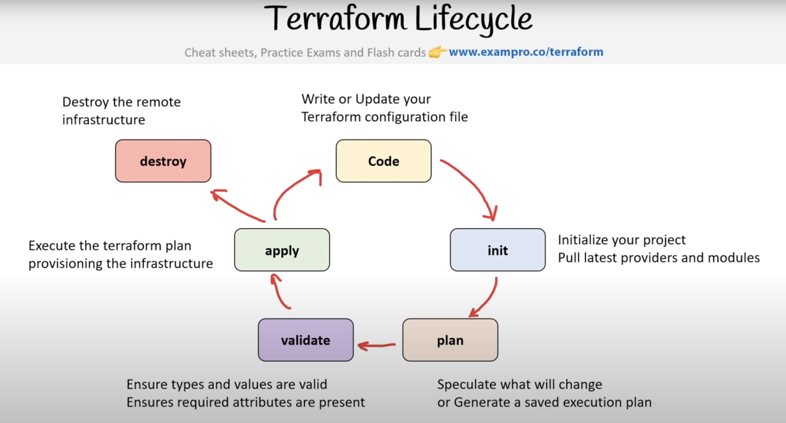

# Hashicorp Terraform Associate Cloud Engineer Certification - Updated for 004 Version

## 1. Understand infrastructure as code (IaC) concepts

### 1a. Explain what Infrastructure-as-Code (IaC) is

* Infrastructure as Code (IaC) is the managing and provisioning of infrastructure (CPUs, memory, disk, firewalls, etc) defined as code within definition files instead of using a manual processes.
* Standardized approach
* Track your infrastructure
* Collaboration
  * Hashicorp Cloud Platform
* With IaC, configuration files are created that contain your infrastructure specifications, which makes it easier to edit and distribute configurations. It also ensures that you provision the same environment every time

#### Infrastructure Lifecycle

* Number of **clearly defined and distinct work phases** which are used by DevOps Engineers to **_plan, design, build, test, deliver, maintain, and retire_** cloud infrastructure
* IaC can be applied throughout the lifecycle, both on the initial build, and throughout the life of the infrastructure. Commonly, these are referred to as _**Day 0 - 2**_ activities.
  * **“Day 0”**:
    * Plan and Design
  * **“Day 1”**
    * Develop and iterate
    * code provisions and configures your initial infrastructure
    * refers to OS and application configurations you apply after you’ve initially built your infrastructure.
  * **"Day 2"**
    * Go live and maintain

#### Popular IaC Tools

* Declarative
  * What you see is what you get, (i.e.; **Explicit**)
  * More verbose, but zero chance of misconfiguration
  * Use scripting languages
  * Tooling:
    * ARM Templates / Bicep
      * Supports only Azure
    * Azure Blueprints
      * Supports only Azure
      * Manages relationship between services
    * CloudFormation
      * Only supports AWS
    * Cloud Deployment Manager
      * Only supports GCP
    * Terraform
      * Supports many cloud service providers (CSPs) and services
* Imperative
  * You say what you want, the rest is filled in (**Implicit**)
  * Less verbose, you could end up with misconfiguration
  * Does more than Declarative
  * Uses programming languages eg. Python, Ruby, Javascript
  * Tools
    * AWS Cloud Development Kit (CDK)
      * Supports only AWS
      * Mainly built-in templates for opinionated best practices
    * Pulumi
      * Supports AWS, GCP, Azure, k8s
    * Terraform CDK -- (Retired)

#### Idempotent vs Non-Idempotent

* Non-Idempotent
  * Deploy IaC config it will provision and launch 2 vms
  * After updating IaC config and deploy again 2 additional vms are created
* Idempotent
  * Deploy IaC config it will provision and launch 2 vms
  * After updating iac config and deploy it will update the VMs if changed by **_modifying or deleting and creating new vms_**

#### Provisioning vs Deployment vs Orchestration

* Provisioning
  * To prepare a server with systems, data, software, and make it ready for network operation
  * Using Configuration Management tools like Puppet, Ansible, Chef, Bash scripts, Powershell, or Cloud-Init you can provision a server
  * **_When you launch a cloud service and configure it you are "provisioning" that service_**
* Deployment
  * Is the act of delivering a version of your application to run on a provisioned server
  * Deployment could be performed via AWS CodePipeline, Harness, Jenkins, GitHub Actions, CircleCi
* Orchestration
  * The Act of coordinating multiple systems or services
  * Common term when working with microservices, containers and kubernetes
  * Kubernetes, Salt, Fabric

#### Configuration Drift

* When provisioned infrastructure has an unexpected configuration change due to:
  * manually adjusted configuration options
  * malicious actors trying to cause downtime or breach data
  * side effects from APIs, SDK, or CLIs*
* Detecting configuration drift:
  * compliance tool that can detect misconfiguration
    * AWS Config, Azure Policies, GCP Security Health Analytics or Audit Logs
    * Built-in support for drift detection e.g. AWS CloudFormation Drift Detection
    * Storing the expected state eg. Terraform State files
* Correcting configuration drift:
  * compliance tool that can remediate (correct) misconfiguration e.g. AWS Config
  * Use the `-refresh-only` flag with `terraform apply` and `terraform plan` commands to sync state
    * `$ terraform apply -refresh-only -auto-approve`
  * Manually correcting the configuration (**NOT RECOMMENDED and SHOULD BE AVOIDED**)
  * Tearing down and setting up the infrastructure again
* Preventing configuration drift:
  * **Immutable infrastructure**, always create and destroy, never resuse, Blue/Green deployment strategy.
    * Servers are never modified after they are deployed
      * Baking AMI images or containers via AWS Image Builder, Hashicorp Packer, or a builder server e.g. Cloud Build
  * Using GitOps to version control IaC code and peer reviews
  
### Immutable Infrastructure Guarantee

* Terraform encourages you towards an Immutable Infrastructure Architecture so you get the following guarantees.
  * **Cloud Resource Failure**
    * ec2 instance fails a stutus check
  * **Application Failure** 
    * What if your post installation script fails due to change in packages?
  * **Time to Deploy**
    * need to deploy in a hurry
  * **Worst Case Scenario**
    * Accidental deletion
    * Compromised by malicious actor
    * Need to change regions (region outage)
  * **No Guarantee of 1-to-1**
    * Every time Cloud-Init runs post deploy there is no guarantee its one-to-one with your other VMs
  * **Golden Images**
    * Guarantee of 1-to-1 with the rest of your fleet
    * Increased assurance of consistency, security
    * Speeds up deployments

### 1b. Describe the advantages of IaC patterns

* IaC configuration scripts allows **automate** creating, updating, or destroying  your infrastructure in a safe, consistent, and repeatable way by defining resource configurations that you can version, reuse, and share.
* blueprint of your infrastructure
* Terraform can manage infrastructure on multiple cloud platforms.
* Terraform's human-readable configuration language helps you write infrastructure code quickly.

* Terraform's state allows you to track resource changes throughout your deployments.
* You can commit your configurations to version control to safely collaborate on infrastructure.
* Key terms:
  * Reliability
    * makes changes **idempotent**, consistent, repeatable, and predictable
      * **idempotent**
        * no matter how many times you run IaC, you will always end up with the same state that is expected.
  * Manageability
    * enable mutation via code
    * revised, with minimal changes
  * Sensibility
    * avoid financial and reputational losses to even loss of life when considering government and military dependencies on infrastructure

#### GitOps

* use git repo with IaC code to **introduce a formal process to review and accept changes to infrastructure code**, once that code is accepted, it automatically triggers a deploy


#### Change Automation

* What is Change Management?
  * standardized approach to apply change, and resolve conflicts brought about by change
  * in context of IaC, change management is the procedure that will be followed when resources are modified and applied via configuration script
* What is Change Automation?
  * a way of **automatically** creating a consistent, systematic, and predictable way of managing **change request** via controls and policies
  * terraform uses change automation in the form of **Execution Plans** and **Resource Graphs** to apply and review complex **changesets**
  * What is a changeset?
    * a collection of commits that represent changes made to a versioning repository.
    * IaC uses changesets so you can see what has changed by who over time

**Links**:

* Infrastructure as Code → https://developer.hashicorp.com/terraform/intro#infrastructure-as-code
* Infrastructure as Code in a Private or Public Cloud → https://www.hashicorp.com/blog/infrastructure-as-code-in-a-private-or-public-cloud
* Introduction to Infrastructure as Code with Terraform → https://developer.hashicorp.com/terraform

### 1c. Explain how Terraform manages multi-cloud, hybrid cloud, and service-agnostic workflows

#### Providers, Modules, and Provisioners

* Provisioning infrastructure across multiple clouds increases fault-tolerance and reliability, allowing for more graceful recovery from cloud provider outages and not all you infrastructure is affected.
* Multi-cloud deployments add complexity because each provider has its own interfaces, tools, and workflows.
  * Terraform allows you to use the same workflow to manage multiple providers and handle cross-cloud dependencies. This simplifies management and orchestration for large-scale, multi-cloud infrastructures.
* Terraform leverages plugins called providers that allow Terraform to interact with cloud platforms and other services via their application programming interfaces (APIs). HashiCorp and the Terraform community have written over 1,000 providers to manage resources on Amazon Web Services (AWS), Azure, Google Cloud Platform (GCP), Kubernetes, Helm, GitHub, Splunk, and DataDog, just to name a few. Find providers for many of the platforms and services you already use in the Terraform Registry. If you don't find the provider you're looking for, you can write your own.
* Providers define individual units of infrastructure, example compute instance or private networks, as resources.
* Terraform configuration files allow you to compose resources from different providers into re-useable Terraform configurations called modules, and manage them with a consistent language and workflow.

The example below showcases the use of multiple providers in a single terraform configuration file.

```hcl
terraform {
  required_providers {
    google = {
      source = "hashicorp/google"
      version = "4.7.0"
    }
    azurerm = {
      source = "hashicorp/azurerm"
      version = "2.92.0"
    }
  }
}

provider "google" {
  # Configuration options
  credentials = "${file("account-creds.json")}"
  project = "project-123"
  region = "us-central1"
  zone = "us-central1-c"
}

provider "azurerm" {
  # Configuration options
  features {}
}
......
```

* Use of multiple providers to manage different specific clouds (GCP, AWS, Azure, k8s)
* Use the provisioners block to apply Day 0 configurations (example setting up a webserver)

```hcl
provisioner "remote-exec" {
  inline = [
    "sudo apt-get -y update",
    "sudo apt-get -y install nginx",
    "sudo service nginx start"
    ]
}
```

* Day 1 to N configurations can switch to tools like Chef, Ansible, Salt which offer specific providers

```hcl
provider "chef" {
  server_url = "https://api.chef.io/organization/example"
  run_list = [ "recipe[example]" ]
}
```



**Links**:

* Multi-Cloud Deployment → https://developer.hashicorp.com/terraform/intro/use-cases#multi-cloud-deployment

#### Compliance

* Policy and Compliance using [Open Policy Agent (OPA)](https://www.openpolicyagent.org/docs/terraform) or [Hashicorp's Sentinel](https://developer.hashicorp.com/sentinel/docs/terraform) to enforce compliance policies

#### OPA

```json
package terraform.analysis

import input as tfplan

########################
# Parameters for Policy
########################

# acceptable score for automated authorization
blast_radius := 30

# weights assigned for each operation on each resource-type
weights := {
  "aws_autoscaling_group": {"delete": 100, "create": 10, "modify": 1},
  "aws_instance": {"delete": 10, "create": 1, "modify": 1},
}

# Consider exactly these resource types in calculations
resource_types := {"aws_autoscaling_group", "aws_instance", "aws_iam", "aws_launch_configuration"}

#########
# Policy
#########

# Authorization holds if score for the plan is acceptable and no changes are made to IAM
default authz := false

authz if {
  score < blast_radius
  not touches_iam
}

# Compute the score for a Terraform plan as the weighted sum of deletions, creations, modifications
score := s if {
    all_resources := [x |
        some resource_type, crud in weights

        del := crud.delete * num_deletes[resource_type]
        new := crud.create * num_creates[resource_type]
        mod := crud.modify * num_modifies[resource_type]
        x := (del + new) + mod
    ]
    s := sum(all_resources)
}

# Whether there is any change to IAM
touches_iam if {
  all_resources := resources.aws_iam
  count(all_resources) > 0
}

####################
# Terraform Library
####################

# list of all resources of a given type
resources[resource_type] := all_resources if {
  some resource_type, _ in resource_types

  all_resources := [name |
    some name in tfplan.resource_changes
    name.type == resource_type
  ]
}

# number of creations of resources of a given type
num_creates[resource_type] := num if {
  some resource_type, _ in resource_types

  all_resources := resources[resource_type]
  creates := [res |
    some res in all_resources
    "create" in res.change.actions
  ]
  num := count(creates)
}

# number of deletions of resources of a given type
num_deletes[resource_type] := num if {
  some resource_type, _ in resource_types

  all_resources := resources[resource_type]

  deletions := [res |
    some res in all_resources
    "delete" in res.change.actions
  ]
  num := count(deletions)
}

# number of modifications to resources of a given type
num_modifies[resource_type] := num if {
  some resource_type, _ in resource_types

  all_resources := resources[resource_type]

  modifies := [res |
    some res in all_resources
    "update" in res.change.actions
  ]
  num := count(modifies)
}
```

#### Sentinel

```hcl
import "tfplan"

main = rule {
  all tfplan.resources.aws*instance as *, instances {
    all instances as \_, r {
      (length(r.applied.tags) else 0) > 0
    }
  }
}
```

[Back to Exam Guide](README.md)