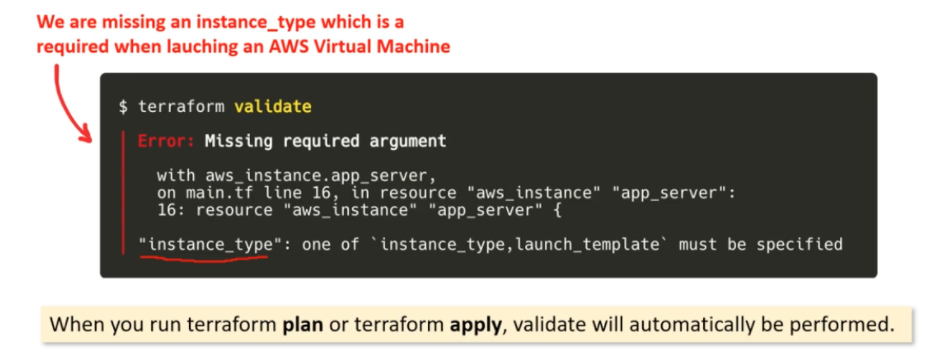
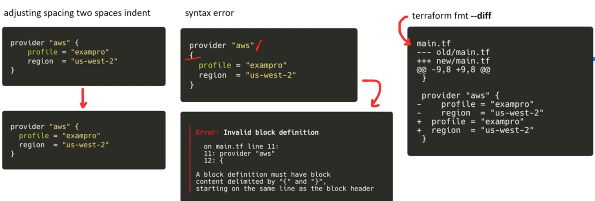

# Hashicorp Terraform Associate Cloud Engineer (003) Certification

## 3. Core Terraform Workflow

### 3a. Describe Terraform Workflow (Write → Plan → Create)

#### Terraform Core Workflow → as an individual practitioner

* Made up of three stages:
  * **Write**
    * Define resources using HCL which may span multiple cloud Providers
      * ex: create a configuration to deploy an application on a virtual machine in a Virtual Private Cloud (VPC) network with security groups and a load balancer
    * Store work in VCS (like GitHub)
  * **Plan**
    * Initialize the working directory with `terraform init`
    * Terraform creates an execution plan describing the infrastructure that will be created, updated, and or destroyed based on the existing infrastructure and your configuration (`terraform plan`)
    * Save plan output use `terraform plan -out [PLAN NAME]`
  * **Create**
    * Once approved, Terraform performs the proposed operations in the correct order while respecting dependencies. Example, if you create a vm in vpc, terraform will make sure to (re)create the vpc first before creating the vm.

    

#### Working as a Team

Same as the Core workflow except individuals save their changes to version control branches to avoid colliding with each other's work. Working in branches enables team members to resolve mutually incompatible infrastructure changes using their normal merge conflict workflow.

```hcl
$ git checkout -b add-load-balancer

Switched to a new branch 'add-load-balancer'
```

Pull request are used to merge changes into a shared team collaboration branch.

Using **Plan** provides a way for team members to review each others work and ask questions, evaluate risks, and catch mistakes before any potential harmful changes. Natural plan for this is with pull request and version control.

Once a pull request has been approved and merged, it's important for the team to review the final concrete plan that's run against the shared team branch and the latest version of the state file.

Depending on the change, sometimes team members will want to watch the apply output as it is happening. For teams that are running Terraform locally, this may involve a screen share with the team. For teams running Terraform in CI, this may involve gathering around the build log.

Just like the workflow for individuals, the core workflow for teams is a loop that plays out for each change. For some teams this loop happens a few times a week, for others, many times a day.

#### Core Enhanced Using Hashicorp's HCP Platform

Same as the team workflow except the backend is configured to use HCP Terraform Cloud as shown in the example below:

```hcl
terraform {
  cloud {
    organization = "my-org"
    hostname = "app.terraform.io" # Optional; defaults to app.terraform.io

    workspaces {
      tags = {
        layer = "networking"
        source = "cli"
      }
      
      # For terraform versions below 1.10, you must specify key-only tags
      # using a list of strings. Example:
      # tags = ["networking", "source:cli"]
    }
  }
}
```

After you configure the backend integration, an HCP Terraform API key is all that is required by your team members in order to edit the config and run speculative plans against the latest version of the state file using all the remotely stored input variables.

```hcl
$ terraform workspace select my-app-dev
Switched to workspace "my-app-dev".

$ terraform plan

Running plan remotely in Terraform Enterprise.

Output will stream here. To view this plan in a browser, visit:

https://app.terraform.io/my-org/my-app-dev/.../

Refreshing Terraform state in-memory prior to plan...

# ...

Plan: 1 to add, 0 to change, 0 to destroy.
```

All plan runs and Apply approval flows are done directly in the HCP Terraform Cloud platform.

#### Links

* The Core Terraform Workflow ⇒ https://www.terraform.io/guides/core-workflow.html
* Build Infrastructure ⇒ https://learn.hashicorp.com/tutorials/terraform/aws-build

### 3b. Initialize a Terraform Working directory (`terraform init`)

#### Command `init`

`terraform init` initializes your terraform project by:

* Downloading plugin dependencies (e.g. Providers and Modules)
  * As of [terraform v0.13 this includes third-party and community providers](https://www.hashicorp.com/blog/automatic-installation-of-third-party-providers-with-terraform-0-13)
* `init` can be run against an empty directory with the `-from-module={MODULE_SOURCE}` option, in which case the given module will be copied into the target directory before any other initialization steps are run
  * supports two use-cases:
    * Given a version control source, it can serve as a shorthand for checking out a config from version control and then initializing the working directory for it.
    * If the source refers to an example configuration, it can be copied into a local directory to be used as a basis for a new config
* Creating a `.terraform` directory in the current working directory
  * Use the `TF_DATA_DIR` environment variable to change the location of this directory
* Creating a dependency lock file (`.terrraform.hcl.lock`) to enforce expected versions for plugins and terraform itself.
* If a backend configuration is specified in the Terraform configuration settings it will be initialized, otherwise it will assume `local backend` is used and will generate a `terraform.tfstate` file in the current directory.

Terraform `init` is generally the first command in the Core Workflow you will run for a new terraform project. If you modify or change dependencies run `terraform init` again to have it apply the changes.

Usage:

* `terraform init -input=true`:
  * asks for input if necessary, if false, will error if input was required.
* `terraform init -upgrade`:
  * Upgrades all plugins/modules to the latest version that complies with the configuration's version constraint
* `terraform init -get-plugins-false`:
  * Skip plugin installation
  * This option has been removed in Terraform 0.15
  * Superceeded by the [`provider_installation`](https://www.terraform.io/cli/config/config-file#provider-installation) and [`plugin_cache_dir`](https://www.terraform.io/cli/config/config-file#plugin_cache_dir) settings.
* `terraform init -get=false`:
  * Skips child module installation
* `terraform init -plugin-dir=PATH`:
  * Force plugin installation to read plugins only from the target directory
* `terraform init -lockfile={MODE}`
  * Set a dependency lock file mode
  * Valid MODE values are:
    * `readonly` to suppress the lockfile changes but verify checksums against the info already recorded. This conflicts with `-upgrade` flag.
* `terraform init -reconfigure`:
  * disregards any existing backend configuration and prevents migration of any existing state.
* `terraform init -migrate-state`:
  * will attempt to copy existing state to the new backend
  * may require interactive prompts for confirmation
  * use the `-force-copy` flag to suppress these prompts and answer _yes_.
* `terraform init -backend=false`:
  * Skips backend configuration
* `terraform init -backend-config=...`:
  * option to use [partial backend configuration](https://www.terraform.io/language/settings/backends/configuration#partial-configuration)

The `init` command creates a lock file (`.terraform.lock.hcl`) to pin provider versions.

Reasons to re-initialize a config:

* adding a new provider
* upgrading/downgrading the version of a provider with `terraform init -upgrade`
* adding a new module
* upgrading/downgrading the version of a module with `terraform init -upgrade`
* changing the location of the backend (statefile)

Links:

* Command: `init`→ https://www.terraform.io/docs/cli/commands/init.html
* Build Infrastructure - Initialization → https://learn.hashicorp.com/tutorials/terraform/aws-build#initialize-the-directory

### 3c. Validate a Terraform configuration (`terraform validate`)

#### Command `validate`

* validates the syntax and arguments of the Terraform configuration files in a directory.
* runs checks that verify whether a configuration is syntactically valid and internally consistent, regardless of any provided variables or existing state.

_Validate_ is useful for general verification of reusable modules, including the correctness of attribute names and value types

It DOES NOT :

* access remote services (i.e. remote state, provider APIs, etc)
* Check with backend provider to insure external consistency



Usage:

* `-json` : Produces output in JSON Format, always disables color.
* `-no-color`: output won't contain any color.

Links:

* Command: validate → https://www.terraform.io/docs/cli/commands/validate.html
* Troubleshoot Terraform → https://learn.hashicorp.com/tutorials/terraform/troubleshooting-workflow#validate-your-configuration

### 3d. Generate and review an execution plan for Terraform (`terraform plan`)

#### Execution Plan

* A manual review of what will be **added, changed, or destroyed** before you apply changes e.g. terraform apply/destroy, (a.k.a) a `Terraform Plan`

##### Command `plan`

`terraform plan` command creates an execution plan (aka Terraform Plan).

A plan consists of:

* Reading the current state of any already-existing remote objects to make sure that the Terraform state is up-to-date.
* Comparing the current configuration to the prior state and noting any differences.
* Proposing a set of change actions that should, if applied, make the remote objects match the configuration.

_Terraform plan_ does not carry out proposed changes.

A _Terraform Plan file_ is a binary file. If you open it up you’ll just see machine code

* **Speculative Plans**
  * Run `terraform plan`
  * Terraform will output the description of the effect of the plan but without any intent to actually apply it.
* Saved Plans
  * Run `terraform plan -out=FILE`
    * generates a saved plan file which you can then pass along to terraform apply. eg `terraform apply {FILE}`
  * When using save planed it will **not prompt you** to confirm and will act like `--auto-approve`

Running a `terraform plan` has a built in validation check similar to `terraform validate`.

**Usage**:

* `-destroy`: _Destroy Mode_ creates a plan to destroy all remote objects.
* `-refresh-only`: _Refresh-Only Mode_ creates a plan to update state and any root module output values to match changes made to remote objects outside of Terraform.
  * available in Terraform v0.15.4 and later
* `refresh=false`: disables the default behavior of synching Terraform state
* `replace={ADDRESS}`: tells Terraform to replace the resource instance with the given address.
  * cannot be used with the `-destroy` option
  * for terraform v0.15.1 or earlier use `terraform taint {ADDRESS}`
* `target={ADDRESS}`: tells Terraform to focus planning efforts only on the resource instance matching the given address and on any objects those instances depend on.
* `-var 'NAME=VALUE'` : sets a value for a single variable
* `-var-file={FILENAME}`: sets values for many input variables using a variable file _.tfvars_ file.
* `-compact-warnings`: display warnings in a compact form
* `-detailed-exitcode`: returns a detailed exitcode when the command exits (`0`= Success with empty diff, `1` = Error, `2` = Succeeded with non-empty diff(changes present))
* `-input=false`: disables terraform default behavior of prompting for inputs
* `-json`: JSON format output
* `-lock=false`: dont hold a state lock
* `-lock-time={DURATION}`: try getting lock for a period of time (`{DURATION}`) i.e. "3s" for three seconds.
* `-no-color`: don't use color in the output
* `-out={FILENAME}`: save the plan to a file, typical convention is to name it `tfplan`. **DO NOT** name it with a suffix that Terraform recognizes (`.tf`)
* `-parallelism={n}`: limit the number of concurrent operations as Terraform walks the graph. Defaults to 0.
* `-chdir`: overriding the root module directory

**Links**:

* Command: plan --> https://www.terraform.io/docs/cli/commands/plan.html

### 3e. Apply changes to infrastructure with Terraform (`terraform apply`)

#### Command `apply`

The `terraform apply` command executes the actions proposed in an execution plan (aka Terraform Plan)

* Automatic Plan Mode
  * When you run `terraform apply`, executes plan, validate, and then apply.
  * Requires users to manually approve the plan by writing “yes”
  * `terraform apply –auto-approve` flag will automatically approve the plan.
* Saved Plan Mode
  * When you provide a filename to terraform to use the saved plan file `terraform apply {FILE}` performs exactly the steps specified by that plan file. It does not prompt for approval; if you want to inspect a plan file before applying it, you can use `terraform show`.

Usage:

* `-auto-approve`: Skips interactive approval, ignored if you pass in a previously saved plan
* `-compact-warnings`: Shows any warning messages in a compact form, summary messages.
* `-input=false`: Disables all of Terraform's interactive prompts. During `apply` this will assume you DO NOT want to apply the plan.
* `-json`: Enables the output to be displayed in json
* `-lock=false`: don't hold state lock
* `-lock-timeout={DURATION}`: retry state lock for a period of time.
* `-destroy`: destroys the remote objects, this option only exists in Terraform 0.15 and later.
  * Use `terraform destroy` for earlier versions.

**Links**:

* Command: apply → https://www.terraform.io/docs/cli/commands/apply.html
* Build Infrastructure - Apply Changes → https://learn.hashicorp.com/tutorials/terraform/aws-build#create-infrastructure

### 3f. Destroy Terraform-managed infrastructure (`terraform destroy`)

#### Command `destroy`

The `terraform destroy` command executes the actions proposed in an execution plan whose sole purpose is to destroy all remote objects managed by Terraform.

Usage:

This command is a wrapper and alias to
`terraform apply -destroy`, therefore it accepts the same options as `apply`.

Using `terraform plan -destroy` you can see the affects of destroying would be in a speculative way without executing them.

**Links**:

* Command: destroy → https://www.terraform.io/docs/cli/commands/destroy.html
* Destroy Infrastructure → https://learn.hashicorp.com/tutorials/terraform/aws-destroy

### 3g. Apply formatting and style adjustments to a configuration (`terraform fmt`)

#### Command `fmt`

Rewrites Terraform configuration files to a standard format and style. This command applies a subset of the Terraform language style conventions along with other minor adjustments for readability. The command is intentionally opinionated and has no customization options because its primary goal is to encourage consistency of style between different Terraform codebases, event though the chosen style can never be everyone's favorite.

Recommended to follow the style conventions applied by `fmt` when writing Terraform modules.

By default `fmt` will look in the current directory and apply formatting to all `.tf` files.

It WILL NOT fix your errors!


Usage:

* `-h,-help`: gives more details about the command
* `-list=false`:
  * Don't list files containing formatting inconsistencies
* `write=false`:
  * Don't overwrite the input files
* `diff`:
  * Display diffs of formatting changes
* `-check`:
  * Check the input is formatted. Exit status will be 0 if all input is properly formatted and non-zero otherwise.
* `-recursive`:
  * Process all files in subdirectories as well. By default, only the given directory (or current) is processed.

#### Style Conventions

* Indent two spaces for each nesting level
* Align equal signs when using multiple arguments with single-line values which appear on consecutive lines at the same nesting level
* Use empty lines to separate logical groups of arguments within a block
* When both arguments and blocks appear together inside a block body, place all of the arguments together at the top and then place nested blocks below them. Use one blank line to separate the arguments from the blocks.
* For blocks that contain both arguments and "meta-arguments" (as defined by the Terraform language semantics), list meta-arguments first and separate them from other arguments with one blank line. Place meta-argument blocks last and separate them from other blocks with one blank line.

```hcl
  resource "aws_instance" "example" {
  count = 2 # meta-argument first

  ami           = "abc123"
  instance_type = "t2.micro"

  network_interface {
    # ...
  }

  lifecycle { # meta-argument block last
    create_before_destroy = true
  }
}
```

* Top-level blocks should always be separated from one another by one blank line. Nested blocks should also be separated by blank lines, except when grouping together related blocks of the same type (like multiple provisioner blocks in a resource).
* Avoid separating multiple blocks of the same type with other blocks of a different type, unless the block types are defined by semantics to form a family. (For example: root_block_device, ebs_block_device and ephemeral_block_device on aws_instance form a family of block types describing AWS block devices, and can therefore be grouped together and mixed.)

#### Coding Style

Writing Terraform code in a consistent style makes it easier to read and maintain. The following sections discuss code style recommendations, including the following:

* Run `terraform fmt` and `terraform validate` before committing your code to version control.
* Use a linter such as TFLint to enforce your organization's own coding best practices.
* Use # for single and multi-line comments.
* Use nouns for resource names and do not include the resource type in the name.
* Use underscores to separate multiple words in names. Wrap the resource type and name in double quotes in your resource definition.
* Let your code build on itself:
  * define dependent resources after the resources that reference them.
* Include a type and description for every variable.
* Include a description for every output.
* Avoid overuse of variables and local values.
* Always include a default provider configuration.
* Use count and for_each sparingly.

[Style Guide](https://developer.hashicorp.com/terraform/language/style)

**Links**:

* Command: fmt → https://developer.hashicorp.com/terraform/cli/commands/fmt
* Troubleshoot Terraform → https://developer.hashicorp.com/terraform/tutorials/configuration-language/troubleshooting-workflow#format-the-configuration

[Back to Exam Guide](README.md)
