# Hashicorp Terraform Associate Cloud Engineer (003) Certification

## 4. Terraform Configuration

### 4a. Use and differentiate `resource` and `data` blocks

#### Resources


Resources in configuration files represent infrastructure objects e.g. Virtual Machines, Databases, Virtual Network Components, Storage. This is represented by the `resource` block:

```hcl
resource "aws_instance" "web" {
  ami           = "ami-a1b2c3d4"
  instance_type = "t2.micro"
}
```

A resource type determines the kind of infrastructure object (e.g. aws_instance is an AWS EC2 instance)

A resource belongs to a provider.

Some resource types provide a special timeouts nested block argument that allows you to customize how long certain operations are allowed to take before being considered to have failed.

##### Resource Behavior


When you execute an execution order via `terraform apply` it will perform one of the following to a resource:

* **Create**
  * resources that exist in the configuration but are not associated with a real infrastructure object in the state.
* **Destroy**
  * resources that exist in the state but no longer exist in the configuration.
* **In-place Update**
  * resources whose arguments have changed.
* **Destroy and re-create**
  * resources whose arguments have changed but which cannot be updated in-place due to remote API limitations.

##### Resource Meta-Arguments

Terraform language defines several meta-arguments, which can be used with any resource type to change the behavior of resources.

###### `depends_on`

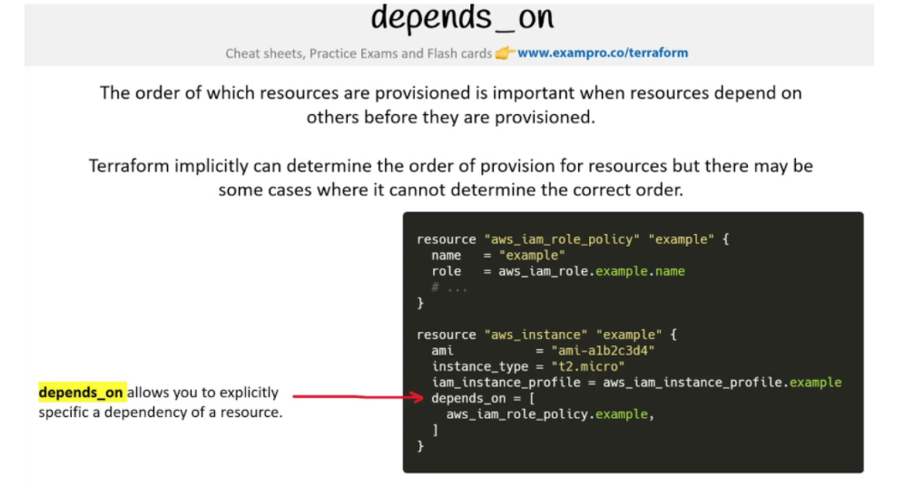

The order of which resources are provisioned is important when resources depend on others before they are provisioned.
Terraform implicitly can determine the order of provision for resources but there may be some cases where it cannot determine the correct order.

`depends_on` allows you to explicitly specify a dependency of a resource.

###### `count`

When you are managing a pool of objects (eg. a fleet of Virtual Machines) you can use count.
Specify the amount of instances you want
Get the current count value (index) via count.index
This value starts at 0
Count can accept numeric expressions:
Must be whole number
Number must be known before configuration.

```hcl
resource "aws_instance" "server" {
  count = 4 # create four similar EC2 instances

  ami           = "ami-a1b2c3d4"
  instance_type = "t2.micro"

  tags = {
    Name = "Server ${count.index}"
  }
}
```

###### `for_each`

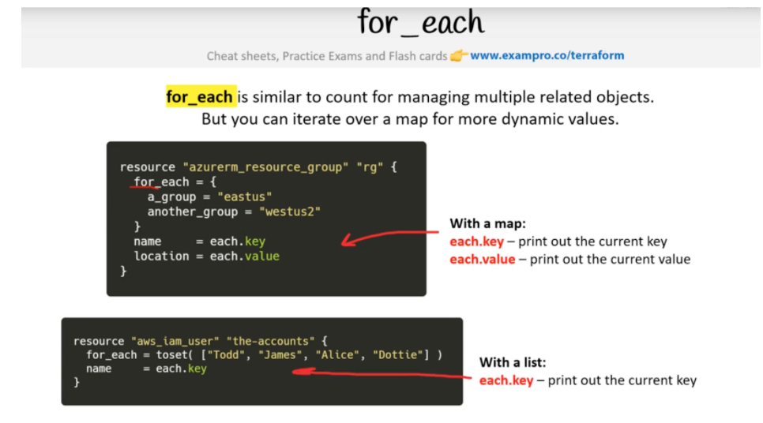

for_each is similar to count for managing multiple related objects.
But you can iterate over a map for more dynamic values.
With a map:

* each.key – print out the current key
* each.value – print out the current value

With a list:

* each.key – print out the current key

###### `dynamic`

Within top-level block constructs like resources, expressions can usually be used only when assigning a value to an argument using the name = expression form. This covers many uses, but some resource types include repeatable nested blocks in their arguments, which typically represent separate objects that are related to (or embedded within) the containing object:

```hcl
resource "aws_elastic_beanstalk_environment" "tfenvtest" {
  name = "tf-test-name" # can use expressions here

  setting {
    # but the "setting" block is always a literal block
  }
}
```

You can dynamically construct repeatable nested blocks like setting using a special `dynamic` block type, which is supported inside resource, data, provider, and provisioner blocks:

```hcl
resource "aws_elastic_beanstalk_environment" "tfenvtest" {
  name                = "tf-test-name"
  application         = "${aws_elastic_beanstalk_application.tftest.name}"
  solution_stack_name = "64bit Amazon Linux 2018.03 v2.11.4 running Go 1.12.6"

  dynamic "setting" {
    for_each = var.settings
    content {
      namespace = setting.value["namespace"]
      name = setting.value["name"]
      value = setting.value["value"]
    }
  }
}
```

A dynamic block acts much like a for expression, but produces nested blocks instead of a complex typed value. It iterates over a given complex value, and generates a nested block for each element of that complex value.

* The `label` of the dynamic block ("setting" in the example above) specifies what kind of nested block to generate.
* The `for_each` argument provides the complex value to iterate over.
* The `iterator` argument (optional) sets the name of a temporary variable that represents the current element of the complex value. If omitted, the name of the variable defaults to the label of the dynamic block ("setting" in the example above).
* The `labels` argument (optional) is a list of strings that specifies the block labels, in order, to use for each generated block. You can use the temporary iterator variable in this value.
* The nested `content` block defines the body of each generated block. You can use the temporary iterator variable inside this block.

Since the `for_each` argument accepts any collection or structural value, you can use a `for` expression or `splat` expression to transform an existing collection.

* splat example
  * `var.list[*].id` is the equivalent for `[for o in var.list : o.id]`

The `iterator` object (setting in the example above) has two attributes:

* `key` is the map key or list element index for the current element.
  * If the `for_each` expression produces a set value then key is identical to value and should not be used.
* `value` is the value of the current element.

###### `lifecycle`

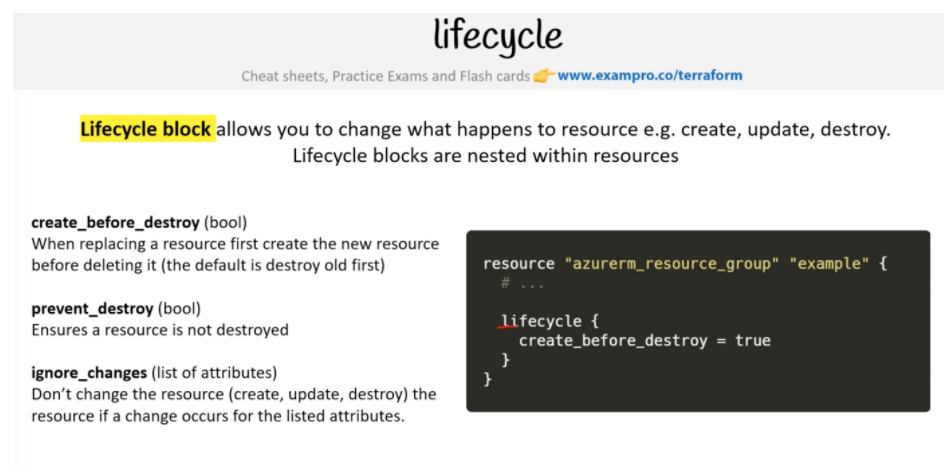

Lifecycle block allows you to change what happens to resources (e.g. create, update, destroy).
Lifecycle blocks are nested within resources:

* `create_before_destroy` (bool)
  * When replacing a resource first create the new resource before deleting it (the default is destroy old first)
  * Useful when resources cant be updated in place after creation
    * Good example → https://registry.terraform.io/providers/hashicorp/aws/latest/docs/resources/launch_configuration#using-with-autoscaling-groups
* `prevent_destroy` (bool)
  * Ensures a resource is not destroyed
* `ignore_changes` (list of attributes)
  * Don’t change the resource (create, update, destroy) if a change occurs for the listed attributes.

Sample:

```hcl
data "aws_ami" "ubuntu" {
  most_recent = true

  filter {
    name   = "name"
    values = ["ubuntu/images/hvm-ssd/ubuntu-trusty-14.04-amd64-server-*"]
  }

  filter {
    name   = "virtualization-type"
    values = ["hvm"]
  }

  owners = ["099720109477"] # Canonical
}

resource "aws_launch_configuration" "as_conf" {
  name_prefix   = "terraform-lc-example-"
  image_id      = data.aws_ami.ubuntu.id
  instance_type = "t2.micro"

  lifecycle {
    create_before_destroy = true
  }
}

resource "aws_autoscaling_group" "bar" {
  name                 = "terraform-asg-example"
  launch_configuration = aws_launch_configuration.as_conf.name
  min_size             = 1
  max_size             = 2

  lifecycle {
    create_before_destroy = true
  }
}
```

The above sample will generate a unique name for the Launch Configuration and can then update the autoscaling group without conflict before destroying the previous Launch Configuration.

#### Ephemeral Resources and Variables

_Ephemeral Resources_ resource blocks define resources that are basically temporary, and are used for handling sensitive values that you do not want Terraform to persist outside of its current operation, which includes state or plan files. This process makes them ideal for managing sensitive or temporary data that you do not want to persist, such as temporary passwords or connections to other systems.

This resource and also leverage Hashicorp Vault or secret manager to access a secret.

```hcl

ephemeral "random_password" "db_password" {
  length           = 16
  override_special = "!#$%&*()-_=+[]{}<>:?"
}

resource "aws_db_instance" "example" {
  instance_class       = "db.t3.micro"
  allocated_storage    = "5"
  engine               = "postgres"
  username             = "example"
  skip_final_snapshot  = true
  publicly_accessible  = true
  db_subnet_group_name = aws_db_subnet_group.example.name 
  password_wo          = ephemeral.random_password.db_password.result ← ephemeral value will not be persisted
  password_wo_version  = 1
}

```

Variables can also be flagged as ephemeral using the `ephemeral = true` condition. Theses can only be by ephemeral resources or ephemeral outputs.

```hcl
variable "session_token" {
  type      = string
  ephemeral = true
}
```


`Ephemeral Write-only Arguments` are only available during the current Terraform operation and does not persist information to state or plan files.
Use these arguments to secretly pass temporary values to resources as shown the in above example:

```hcl
ephemeral "random_password" "db_password" {
  length           = 16
  override_special = "!#$%&*()-_=+[]{}<>:?"
}

resource "aws_db_instance" "example" {
  ...
  
  password_wo          = ephemeral.random_password.db_password.result ← ephemeral value will not be persisted

  ...
}
```

Example using ephemeral resource block and write-only arguments to pull secret from secrets manager

```hcl

# 1. Reference the secret container (standard data source)
data "aws_secretsmanager_secret" "db_secret" {
  name = "production/db/password"
}

# 2. Use an Ephemeral Resource to fetch the value without state persistence
ephemeral "aws_secretsmanager_secret_version" "current_version" {
  secret_id = data.aws_secretsmanager_secret.db_secret.id
}

# 3. Use the value
locals {
  # Parse the secret string and extract the password
  db_password = jsondecode(ephemeral.aws_secretsmanager_secret_version.current_version.secret_string)["password"]
}

# Example usage in a resource
resource "aws_db_instance" "default" {
  # ... other config
  password = local.db_password # Secret is not stored in state
}

```

#### Data Sources

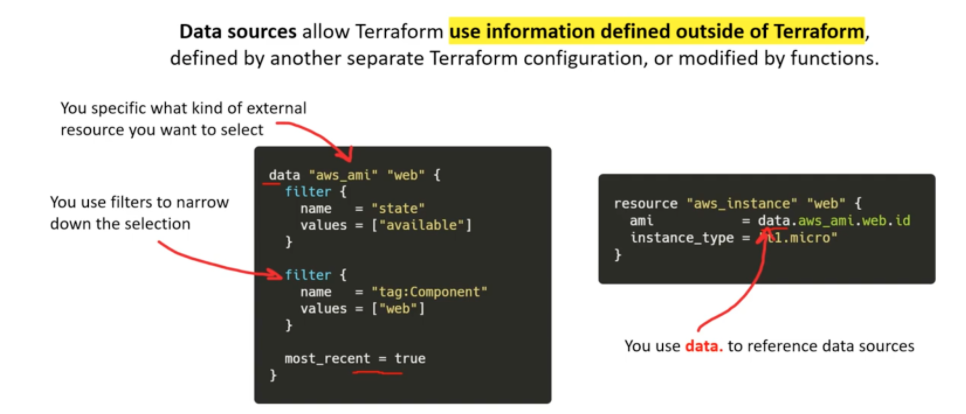

Data sources allow Terraform to use information defined outside of Terraform, defined by another separate Terraform configuration, or modified by functions.
You specify what kind of external resource you want to select
You use filters to narrow down the selection.
You use `data.` to reference data sources

#### References to Named Values

Named Values are built-in expressions to reference various values such as:

* Resources Resource_Type.Name (e.g. `aws_instance.my _server`)
* Input variables `var.Name`
* Local values `local.Name`
* Child module outputs `module.Name`
* Data sources `data.Data_Type.Name`
* Filesystem and workspace info
  * `path.module` - path of the module where the expression is placed
  * `path.root` - path of the root module of the configuration
  * `path.cwd` - path of the current working directory
  * `terraform.workspace` – name of the currently selected workspace
* Block-local values (within the body of blocks)
  * `count.index` (when you use the count meta argument)
  * `each.key` / `each.value` (when you use the for_each meta argument )
  * `self.` - self reference information within the block (provisioners and connections)

Named values resemble the attribute notation for map (object) values but are not objects and do not act as objects.

You cannot use square brackets to access attributes of Named Values like an object.

**Links**:

* Resources → https://developer.hashicorp.com/terraform/language/resources
* Data Sources → https://developer.hashicorp.com/terraform/language/data-sources
* Query Data Sources → https://developer.hashicorp.com/terraform/tutorials/configuration-language/data-sources

### 4b. Refer to resource attributes and create cross-resource references

A resource address is a string that identifies zero or more resource instances in your overall configuration.

An address is made up of two parts:

```hcl
[module path][resource spec]
```

In some contexts Terraform might allow for an incomplete resource address that only refers to a module as a whole, or that omits the index for a multi-instance resource. In those cases, the meaning depends on the context, so you'll need to refer to the documentation for the specific feature you are using which parses resource addresses.

#### Module Path

A module path addresses a module within the tree of modules. It takes the form:

```hcl
module.module_name[module index]
```

Example:

```hcl
module.foo[0].module.bar["a"]
```

* `module` - Module keyword indicating a child module (non-root). Multiple module keywords in a path indicate nesting.
* `module_name` - User-defined name of the module.
* `[module index]` - (Optional) Index to select an instance from a module call that has multiple instances, surrounded by square bracket characters ([ and ]).

#### Resource spec

A resource spec addresses a specific resource instance in the selected module. It has the following syntax:

```hcl
resource_type.resource_name[instance index]
```

* `resource_type` - Type of the resource being addressed.
* `resource_name` - User-defined name of the resource.
* `[instance index]` - (Optional) Index to select an instance from a resource that has multiple instances, surrounded by square bracket characters ([ and ]).
  * if `count` is used, ref is a list accessed with [N]
  * if `for_each` is used, ref is a map accessed with ["key"]

Example:

```hcl
resource "aws_instance" "web" {
  # ...
  count = 4
}
```

The instance level address is `aws_instance.web[3]` where the address like so `aws_instance.web` refers to all "web" instances, in the case of the example above the number of instances is 4 (0-3).

Use the `*` (splat expression) to return all the ids of the list of instances → `aws_instance.web[*].id` or use the index `aws_instance.web[0].id` to return a single value.

Another example using a `for_each`:

```hcl
resource "aws_instance" "web" {
  # ...
  for_each = tomap({
    "terraform": "value1",
    "resource":  "value2",
    "indexing":  "value3",
    "example":   "value4",
  })
}
```

The instance level address is `aws_instance.web["example"]` or `[for value in aws_instance.example: value.id]` returns a list of all of the ids of each of the instances.

**Other**:

* Input variables are access via `var.<NAME>`
* Locals `local.<NAME>`
* Child module outputs `module.<MODULE_NAME>`
  * same `count` and `for_each` rules as resources
* Data blocks `data.<DATA_TYPE>.<NAME>`
  * same `count` and `for_each` rules as resources
* Filesystem/workspace info
  * `path.module` location of expression (don't use in write operations)
  * `path.root` for root module location
  * `terraform.workspace` currently selected workspace
* Block `local` values
  * `count.index`
  * `each.key`/ `each.value`
  * `self`
    * represents the parent resource, and has all of that resource's attributes.

**Links**:

* Resource Addressing → https://developer.hashicorp.com/terraform/cli/state/resource-addressing
* References to Named Values → https://developer.hashicorp.com/terraform/language/expressions/references
* Create Resource Dependencies → https://developer.hashicorp.com/terraform/tutorials/configuration-language/dependencies

### 4c. Use variables and outputs

**Local variables**:

* assigns a name to an expression, so you can use it multiple times within a module/function without repeating it.
* Locals are set using the `locals` block ← Static value

**Input Variables**:

* function arguments
  * declared in a `variable` block
    * name can be any valid name except:
      * `source`
      * `version`
      * `providers`
      * `count`
      * `for_each`
      * `lifecyle`
      * `depends_on`
      * `locals`
  * input order of precedence
    * command line (`-var` & `-var-file`) → `*.auto.tfvars` or `*.auto.tfvars.json` → `terraform.tfvars.json` → `terraform.tfvars` → env vars → defaults in `variable` block
      * NOTE: Values defined in HCP Terraform and on the command line take precedence over other ways of assigning variable values. The variable's default argument is at the **lowest level** of precedence.
      * NOTE: `terraform.tfvars` is the most popular way for manipulating variables used out in the wild

#### Loading Variables

* Default Auto-loaded variables file `terraform.tfvars`:
  * When you create a named `terraform.tfvars` file it will be automatically loaded when running terraform apply.
* Additional Variables Files (not auto-loaded):
  * ex: `my_variables.tfvars`
  * You can create additional variables files eg. dev.tfvars, prod.tfvars, they will not be auto-loaded (you’ll need to specific them in via command line)
    * `terraform plan -var-file=my_variables.tfvars`
* Additional variables files (auto-loaded):
  * ex: `my_variables.auto.tfvars`
  * If you name your file with `.auto.tfvars` it will always be loaded
  * Specify a Variables file via Command Line `-var-file dev.tfvars`
* You can specify variables inline via the command line for individual overrides:
  * Inline Variables via Command Line `-var ec2_type=“t2.medium”`
* Environment Variables
  * TF_VAR _my _variable _name
  * Terraform will watch for environment variables that begin with `TF_VAR_` and apply those as variables.

**Output variables**:

* function return values
* expressed in the `output` block
* root module, the output is displayed to the user
* computed/rendered values after a Terraform apply is performed. 
* Outputs allow you:
  * to obtain information after resource provisioning e.g. public IP address
  * output a file of values for programmatic integration
  * Cross-reference stacks via outputs in a state file via `terraform_remote _state`
* You can optionally provide a description
* Similar to Input you can mark the output as sensitive (`sensitive=true`) so it does not show in the output of your Terminal, however the value is **STILL** visible within the state file.
  * NOTE: If you mark an input as sensitive but not an output it will error out
* To print all the outputs for a state file use the `terraform output` command.
* Print a specific output with `terraform output {name}` command
  * Use the `–json` flag to get output as json data.
  * Use the `–raw` flag to preserve quotes for strings
* Use the `ephemeral=true` in the output block on child modules to pass data between modules without persisting them in state
  * NOTE:
    * root module outputs cannot use the `ephemeral` argument
    * The value of the output block must come from an ephemeral context.
    * You can only reference that output in other ephemeral contexts.

**Declaring an output value**:

```hcl
output "instance_ip_addr" {
  value = aws_instance.server.private_ip
}
```

Since output values are just a means for passing data out of a module, it is usually not necessary to worry about their relationships with other nodes in the dependency graph.

However, when a parent module accesses an output value exported by one of its child modules, the dependencies of that output value allow Terraform to correctly determine the dependencies between resources defined in different modules. This can be done leveraging the `depends_on` block, as should below.

```hcl
output "instance_ip_addr" {
  value       = aws_instance.server.private_ip
  description = "The private IP address of the main server instance."

  depends_on = [
    # Security group rule must be created before this IP address could
    # actually be used, otherwise the services will be unreachable.
    aws_security_group_rule.local_access,
  ]
}
```

The `depends_on` argument should be used only as a last resort. When using it, always include a comment explaining why it is being used, to help future maintainers understand the purpose of the additional dependency.

**Links**:

* Input variables → https://developer.hashicorp.com/terraform/language/values/variables
* Customize Terraform Configuration with Variables → https://developer.hashicorp.com/terraform/tutorials/configuration-language/variables
* Output Data from Terraform → https://developer.hashicorp.com/terraform/tutorials/configuration-language/outputs

### 4d. Understand and use complex types

#### Complex Types

A complex type is a type that groups multiple values into a single value.
Complex types are represented by type constructors, but several of them also have shorthand keyword versions.

There are two categories of complex types:

* collection types (for grouping similar values)
  * List, Map, Set
* structural types (for grouping potentially dissimilar values)
  * Tuple, Object

#### Collection Types

A collection type allows multiple values of one other type to be grouped together as a single value.
The type of value within a collection is called its element type.

The three kinds of collection type:

* **List** (`list(..)`)
  * It's like an array, you use an integer as the index to retrieve the value. All values must be of the same type. 
  * Sequence of ordered elements starting a 0
* **Map** (`map(..)`)
  * It's like a ruby hash or single nested JSON object. You use a key as the index to retrieve the value
  * Sequence of key/value pairs separated by a comma
  * Can confusingly use both = or : as the k/v separator
  * Can use either `{}`, `:`, or `=` to define maps
    * Example: `{ "foo": "bar", "bar": "baz" }` and `{ foo = "bar", bar = "baz" }`
* **Set** (`set(...)`)
  * Is similar to a list but has no secondary index or preserved ordering, all values must be of the same type and will be cast to match based on the first element
  * a collection of unique, unordered, unrepeating values

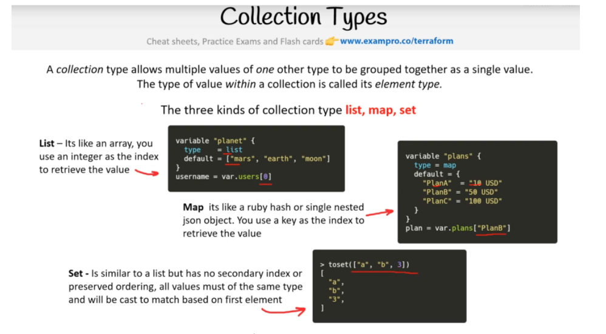

#### Structural Types

A structural type allows multiple values of several distinct types to be grouped together as a single value.
Structural types require a schema as an argument, to specify which types are allowed for which elements.
The two kinds of structural type, object, and tuple.

* **Object** (`object(...)`)
  * name attributes where each has its own type
  * is a map with more explicit keying:
    * `object({ name=string, age=number })`
    * Example:
      * `{ name = "John", age = 52 }`
* **Tuple** ('tuple(...)`)
  * sequence of ordered elements (starting at 0)
  * Multiple return types with parameters:
    * `tuple([string, number, bool])`
    * Example:
      * `["a", 15, true]`

#### The any Keyword

The keyword `any` is a special construct that serves as a placeholder for a type yet to be decided. `any` is not itself a type: when interpreting a value against a type constraint containing any, Terraform will attempt to find a single actual type that could replace the any keyword to produce a valid result.

For example, given the type constraint `list(any)`, Terraform will examine the given value and try to choose a replacement for the any that would make the result valid.

Its rarely the correct constraint to use.

#### Conversion of Complex Types

Complex types such as (list/tuple/set and map/object) can usually be used interchangeably within the Terraform language.

##### Core Conversion Methods

* Manual Casting: Use built-in functions to force data into a specific format.
  * `tomap()`: Turns a collection into a map.
  * `tolist()`: Converts sets or tuples into indexed lists.
  * `jsondecode()`: Transforms a JSON string into a native Terraform object.
* Automatic Coercion
  * If you define a strict type in a variable, Terraform automatically converts inputs (e.g., changing the string "true" to a boolean true).
* Structural Flattening
  * The `flatten()` function is the "Swiss Army Knife" for nested data. It converts a Map of Lists into a Flat List, making it compatible with for_each.

```hcl
locals {
  # Nested Input
  tiers = {
    web = ["10.0.1.0", "10.0.2.0"]
    db  = ["10.0.3.0"]
  }

  # Flattened for a single Resource loop
  network_list = flatten([
    for name, ips in local.tiers : [
      for ip in ips : { tier = name, ip = ip }
    ]
  ])
}
```

* Objects and Maps are similar, as in a map can be converted to an object if it has at least the keys required by the object schema anything additional will be discarded
* Lists and Tuples are similar, as in a list can only be converted to a tuple IF it has exactly the required number of elements.
* Sets are _almost_ similar to both _tuples_ and _lists_:
  * duplicate values are discarded during conversion from list/tuple
  * when converting to list/tuple the elements will be in an arbitrary order, strings will be lexicographical order, other types are not guaranteed

##### Strings and String Templates

Strings can be the following:

* Double quotes: `“” → “Hello”`
* Double quotes can interpret escape characters:
  * `\n` → Newline
  * `\r` → Carriage Return`
  * `\t` → Tab
  * `\”` → Literal quote (without terminating the string)
  * `\\` → literal backslash
  * `\UNNNNNNN` → unicode character from supplementary planes
* Special escape sequences:
  * `$${` → literal
  * `${`, without beginning an interpolation sequence
    * `“Hello, ${var.name}”`
  * `%%{` → Literal
    * `%{`, without beginning a template directive sequence
      * `“Hello, %{ if var.name != “”  }${var.name}%{ else }unnamed%{ endif }!”`
* Terraform also supports a “heredoc” style
  * Heredoc is a UNIX style multi-line string:

```text
<<EOT
Hello
World
EOT
```

Strings Templates are:

* String interpolation allows you to evaluate an expression between the markers eg. `${ …. }` and converts it to a string.
* String directive allows you to evaluate a conditional logic between the markers eg. `%{ …. }`
* You can use interpolation or directives within a HEREDOC
* You can stripe white spacing that would normally be left by directive blocks by providing a trailing tilde eg. `~`

**Links**:

* Complex Types → https://developer.hashicorp.com/terraform/language/expressions/type-constraints#complex-types
* Customize Terraform configuration with variables → https://developer.hashicorp.com/terraform/tutorials/configuration-language/variables

### 4e. Write dynamic configuration using expressions and functions

Terraform language includes a number of built-in functions that you can call from within expressions to transform and combine values.

#### Numeric Functions

* `abs` returns the absolute value of the given number
* `floor` returns the closest whole number that is less than or equal to the given value, which may be a fraction
* `log` returns the logarithm of a given number in a given base
* `ceil` returns the closest whole number that is greater than or equal to the given value
* `min` takes one or more numbers and returns the smallest number from the set
* `max` takes one or more numbers and returns the greatest number from the set
* `parseint` parses the given string as a representation of an integer in the specified base and returns the resulting number
* `pow` calculates an exponent, by raising its first argument to the power of the second argument.
* `signum` determines the sign of a number, returning a number between -1 and 1 to represent the sign


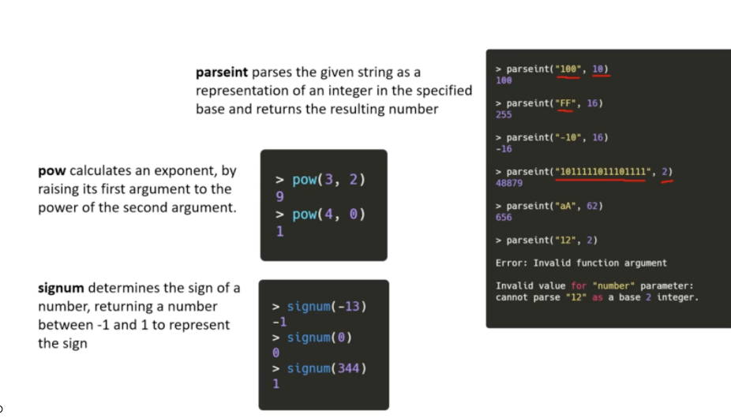

#### String Functions

* `chomp` removes newline characters at the end of a string.
* `format` produces a string by formatting a number of other values according to a specification string
* `endswith` takes two values: a string to check and a suffix string. The function returns true if the first string ends with that exact suffix.
* `formatlist` produces a list of strings by formatting a number of other values according to a specification string
* `indent` adds a given number of spaces to the beginnings of all but the first line in a given multi-line string
* `join` produces a string by concatenating together all elements of a given list of strings with the given delimiter
* `lower` converts all cased letters in the given string to lowercase.
* `regex` applies a regular expression to a string and returns the matching substrings
* `regexall` applies a regular expression to a string and returns a list of all matches
* `replace` searches a given string for another given substring, and replaces each occurrence with a given replacement string
* `split` produces a list by dividing a given string at all occurrences of a given separator.
* `startswith` takes two values: a string to check and a prefix string. The function returns true if the string begins with that exact prefix.
* `strcontains` function checks whether a substring is within another string.
* `strrev` reverses the characters in a string
* `substr` extracts a substring from a given string by offset and length
* `title` converts the first letter of each word in the given string to uppercase
* `trim` removes the specified characters from the start and end of the given string
* `trimprefix` removes the specified prefix from the start of the given string. If the string does not start with the prefix, the string is returned unchanged
* `trimsuffix` removes the specified suffix from the end of the given string
* `trimspace` removes all types of whitespace from both the start and the end of a string
* `upper` converts all cased letters in the given string to uppercase

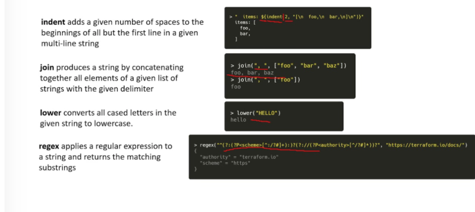
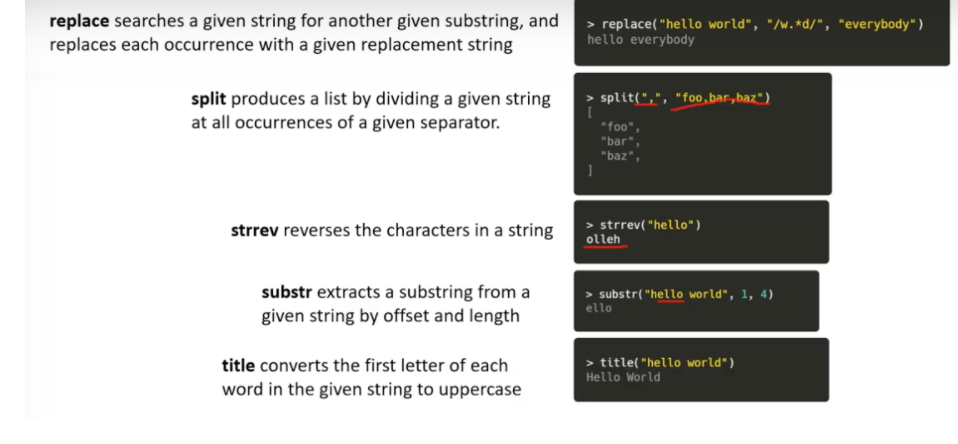
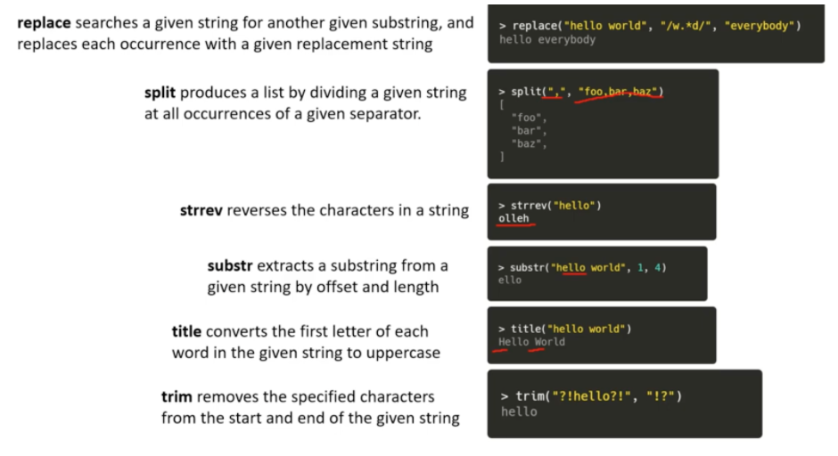
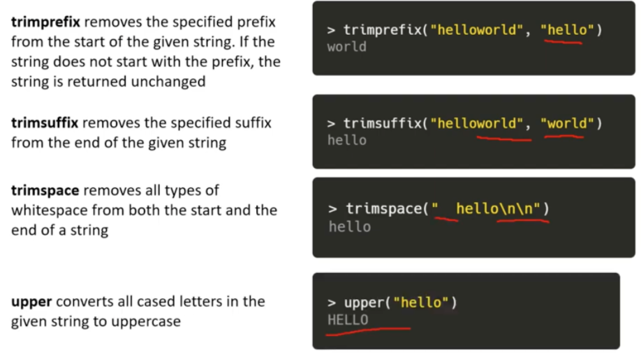

#### Collection Functions

* `alltrue` returns true if all elements in a given collection are true or "true". It also returns true if the collection is empty.
* `anytrue` returns true if any element in a given collection is true or "true". It also returns false if the collection is empty
* `chunklist` splits a single list into fixed-size chunks, returning a list of lists
* `coalesce` takes any number of arguments and returns the first one that isn't null or an empty string
* `coalescelist` takes any number of list arguments and returns the first one that isn't empty
* `compact` takes a list of strings and returns a new list with any empty string elements removed
* `concat` takes two or more lists and combines them into a single list
* `contains` determines whether a given list or set contains a given single value as one of its elements
* `distinct` takes a list and returns a new list with any duplicate elements removed
* `element` retrieves a single element from a list
* `index` finds the element index for a given value in a list
* `flatten` takes a list and replaces any elements that are lists with a flattened sequence of the list contents
* `keys` takes a map and returns a list containing the keys from that map
* `length` determines the length of a given list, map, or string
* `lookup` retrieves the value of a single element from a map, given its key. If the given key does not exist, the given default value is returned instead.
* `matchkeys` constructs a new list by taking a subset of elements from one list whose indexes match the corresponding indexes of values in another list
* `merge` takes an arbitrary number of maps or objects, and returns a single map or object that contains a merged set of elements from all arguments
* `one` takes a list, set, or tuple value with either zero or one elements. If the collection is empty, one returns null. Otherwise, one returns the first element. If there are two or more elements then one will return an error
* `range` generates a list of numbers using a start value, a limit value, and a step value
* `reverse` takes a sequence and produces a new sequence of the same length with all of the same elements as the given sequence but in reverse order
* `setintersection` function takes multiple sets and produces a single set containing only the elements that all of the given sets have in common. In other words, it computes the intersection of the sets
* `setproduct` function finds all of the possible combinations of elements from all of the given sets by computing the Cartesian product.
* `setsubtract` function returns a new set containing the elements from the first set that are not present in the second set. In other words, it computes the relative complement of the first set in the second set
* `setunion` function takes multiple sets and produces a single set containing the elements from all of the given sets. In other words, it computes the union of the sets
* `slice` extracts some consecutive elements from within a list
* `sort` takes a list of strings and returns a new list with those strings sorted lexicographically
* `sum` takes a list or set of numbers and returns the sum of those numbers
* `transpose` takes a map of lists of strings and swaps the keys and 
* `values` takes a map and returns a list containing the values of the elements in that map
* `zipmap` constructs a map from a list of keys and a corresponding list of values

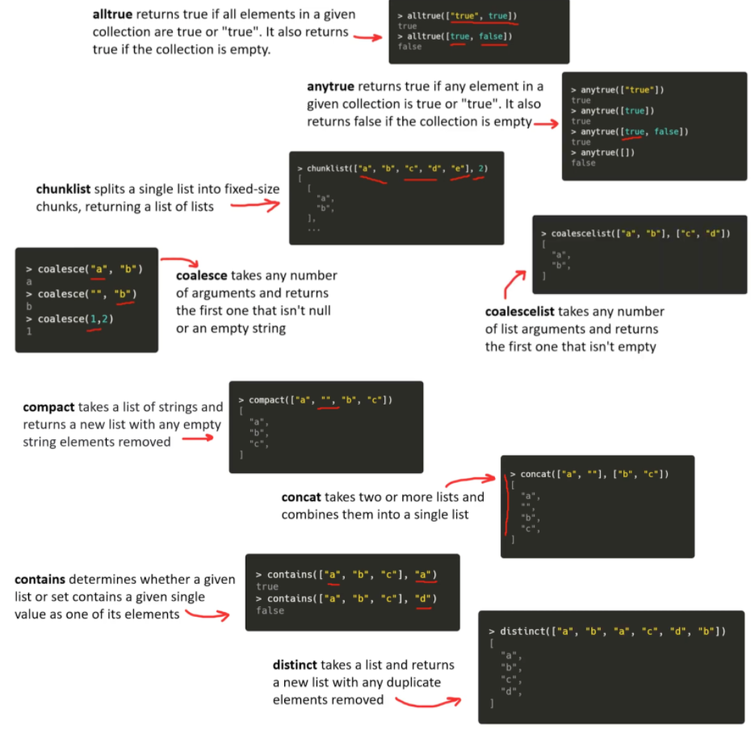
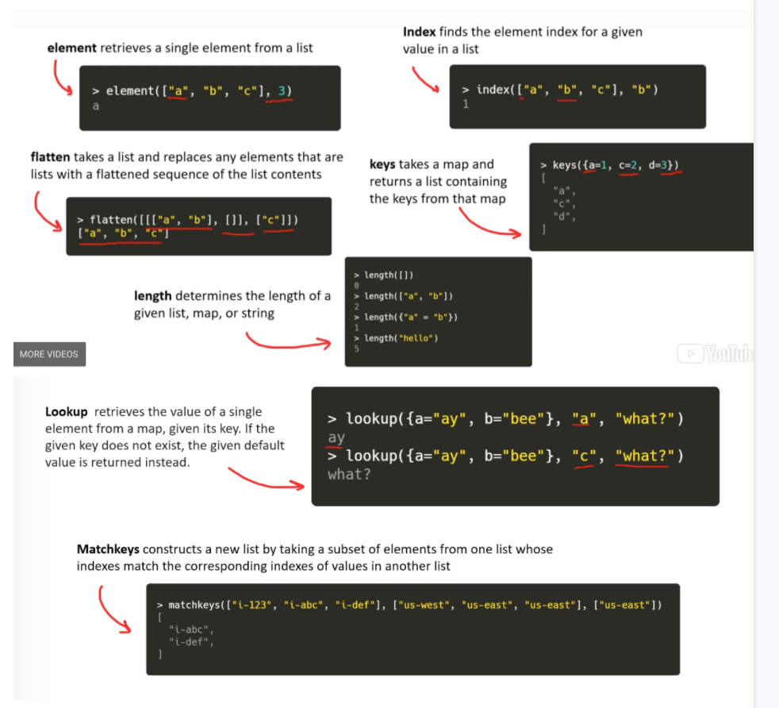
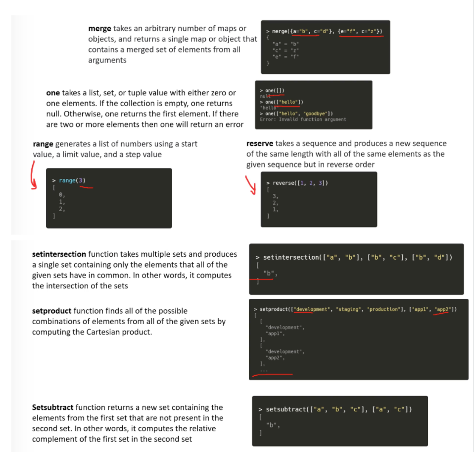
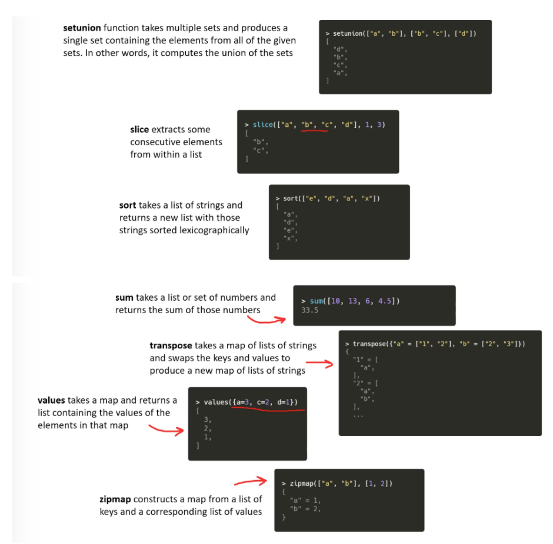

#### Encode Functions

* Encode
  * `base64encode`
  * `jsonencode`
  * `textencodebase64`
  * `yamlencode`
  * `base64gzip`
  * `urlencode`
* Decode
  * `base64decode`
  * `csvdecode`
  * `jsondecode`
  * `textdecodebase64`
  * `yamldecode`

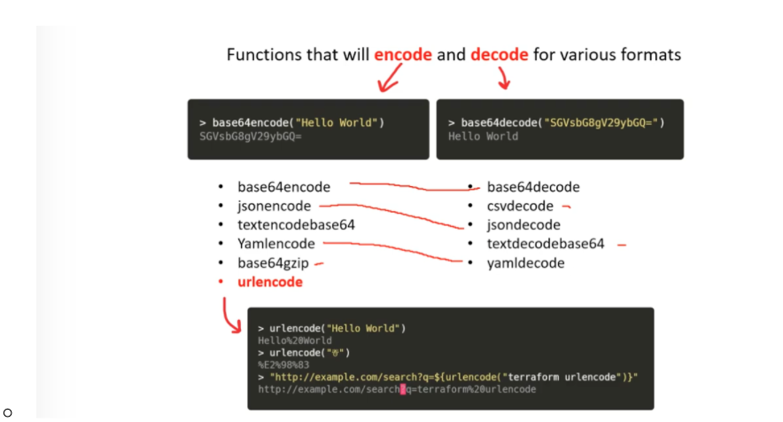

#### Filesystem Functions

* `abspath` takes a string containing a filesystem path and converts it to an absolute path. That is, if the path is not absolute, it will be joined with the current working directory
* `dirname` takes a string containing a filesystem path and removes the last portion from it.
* `pathexpand` takes a filesystem path that might begin with a ~ segment, and if so it replaces that segment with the current user's home directory path
* `basename` takes a string containing a filesystem path and removes all except the last portion from it
* `file` reads the contents of a file at the given path and returns them as a string
* `fileexists` determines whether a file exists at a given path
* `fileset` enumerates a set of regular file names given a path and pattern
* `filebase64` reads the contents of a file at the given path and returns them as a base64-encoded string
* `templatefile` reads the file at the given path and renders its content as a template using a supplied set of template variables

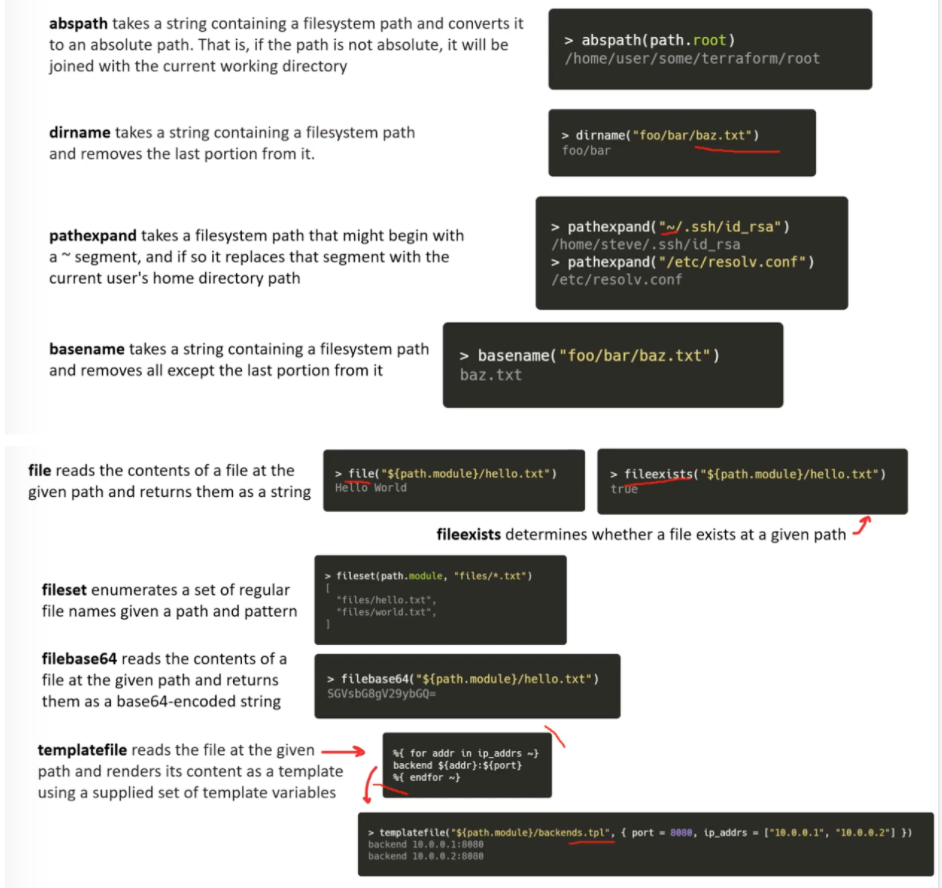

#### Date and Time Functions

* `formatdate` converts a timestamp into a different time format
* `timeadd` adds a duration to a timestamp, returning a new timestamp
* `timestamp` returns a UTC timestamp string in RFC 3339 format
* `timecmp` compares two timestamps and returns a number that represents the ordering of the instants those timestamps represent
* `plantimestamp` returns a UTC timestamp string in RFC 3339 format. function not available in terraform console

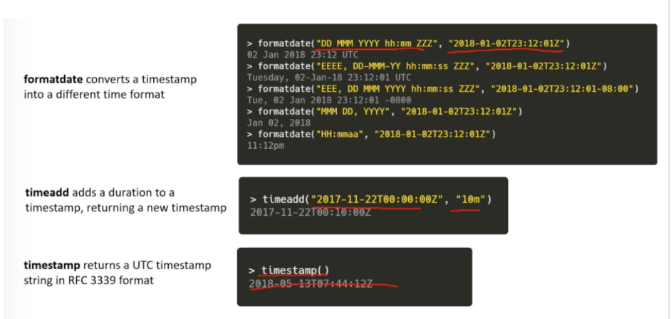

#### Hash and Crypto Functions

* `base64sha256`
* `base64sha512`
* `bcrypt`
* `filebase64sha256`
* `filebase64sha512`
* `filemd5`
* `filesha1`
* `filesha256`
* `filesha512`
* `md5`
* `rsadecrypt`
* `sha1`
* `sha256`
* `sha512`
* `uuid`
* `uuidv5`

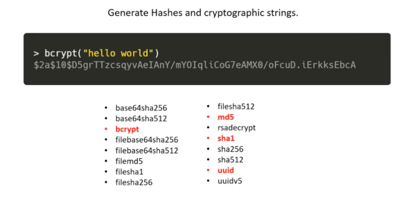

#### IP Network Functions

* `cidrhost` calculates a full host IP address for a given host number within a given IP network address prefix
* `cidrnetmask` converts an IPv4 address prefix given in CIDR notation into a subnet mask address
* `cidrsubnet` calculates a subnet address within given IP network address prefix
* `cidrsubnets` calculates a sequence of consecutive IP address ranges within a particular CIDR prefix.

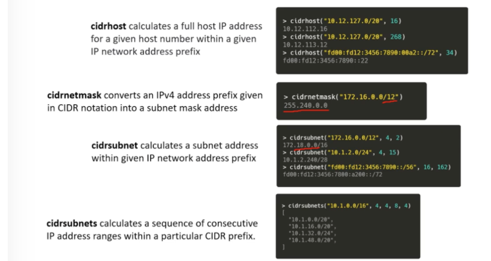

##### Type Conversion Functions

* `can` evaluates the given expression and returns a boolean value indicating whether the expression produced a result without any errors
* `issensitive` takes any value and returns true if Terraform treats it as sensitive, with the same meaning and behavior as for sensitive input variables.
* `defaults` a specialized function intended for use with input variables whose type constraints are object types or collections of object types that include optional attributes
* `nonsensitive` takes a sensitive value and returns a copy of that value with the sensitive marking removed, thereby exposing the sensitive value
* `sensitive` takes any value and returns a copy of it marked so that Terraform will treat it as sensitive, with the same meaning and behaviour as for sensitive input variables.
* `tobool` converts its argument to a boolean value
* `tomap` converts its argument to a map value
* `toset` converts its argument to a set value.
* `tolist` converts its argument to a list value
* `tonumber` converts its argument to a number value
* `tostring` converts its argument to a set value
* `try` evaluates all of its argument expressions in turn and returns the result of the first one that does not produce any errors
* `type` returns the type of a given value

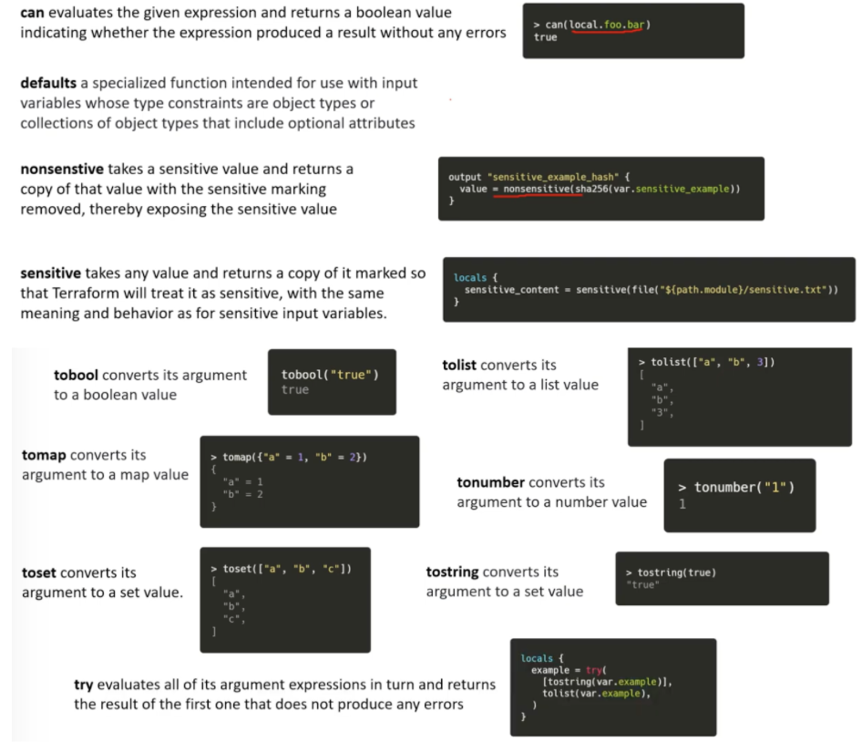

##### Terraform-specific functions

These are only available in Terraform v1.8+
To use these functions you require the following module included in the require_providers blocks

```hcl
terraform {
  required_providers {
    terraform = {
      source = "terraform.io/builtin/terraform"
    }
  }
}
```

* `provider::terraform::encode_tfvars` - takes an object value and produces a string containing a description of that object using the same syntax as Terraform CLI would expect in a .tfvars file.

Call to the function

```hcl
provider::terraform::encode_tfvars({
  example = "Hello!"
})
```

Output

```hcl
example = "Hello!"
```

* `provider::terraform::decode_tfvars` - takes a string containing the content of a `.tfvars` file and returns an object describing the raw variable values it defines.

Call to the function

```hcl
provider::terraform::decode_tfvars(
  <<EOT
    example = "Hello!"
  EOT
)
```

output:

```hcl
{
   example = "Hello"
}
```

* `provider::terraform::encode_expr` - takes any value and produces a string containing Terraform language expression syntax approximating that value.

```hcl
locals {
  workspace_vars = {
    example1 = "Hello"
    example2 = ["A", "B"]
  }
}

resource "tfe_variable" "test" {
  for_each = local.workspace_vars

  category     = "terraform"
  workspace_id = tfe_workspace.example.id

  key   = each.key
  value = provider::terraform::encode_expr(each.value)
  hcl   = true
}
```

**Links**:

* Built-In Functions → https://developer.hashicorp.com/terraform/language/functions
* Perform Dynamic Operations with functions → https://developer.hashicorp.com/terraform/tutorials/configuration-language/functions
* Create Dynamic Expressions → https://developer.hashicorp.com/terraform/tutorials/configuration-language/expressions

#### Dynamic and Conditional Expressions

A _conditional expression_ uses the value of a boolean expression to select one of two values in the format: `condition ? true_val : false_val`

Example:

```hcl
var.a == "" ? "default-a" : var.a
```

##### Dynamic Operations

Using `templatefile`

`user_data.tfpl`

```bash
#!/bin/bash

# Install necessary dependencies
sudo DEBIAN_FRONTEND=noninteractive apt-get -y -o Dpkg::Options::="--force-confdef" -o Dpkg::Options::="--force-confold" dist-upgrade
sudo apt-get update
sudo apt-get -y -qq install curl wget git vim apt-transport-https ca-certificates
sudo apt -y -qq install golang-go

# Setup sudo to allow no-password sudo for your group and adding your user
sudo groupadd -r ${department}
sudo useradd -m -s /bin/bash ${name}
sudo usermod -a -G ${department} ${name}
sudo cp /etc/sudoers /etc/sudoers.orig
echo "${name} ALL=(ALL) NOPASSWD:ALL" | sudo tee /etc/sudoers.d/${name}

# Create GOPATH for your user & download the webapp from github
sudo -H -i -u ${name} -- env bash << EOF
cd /home/${name}
export GOROOT=/usr/lib/go
export GOPATH=/home/${name}/go
export PATH=$PATH:$GOROOT/bin:$GOPATH/bin
git clone https://github.com/hashicorp-education/learn-go-webapp-demo
cd learn-go-webapp-demo
go run webapp.go
EOF
```

```hcl
resource "aws_instance" "web" {
  ami                         = data.aws_ami.ubuntu.id
  instance_type               = "t2.micro"
  subnet_id                   = aws_subnet.subnet_public.id
  vpc_security_group_ids      = [aws_security_group.sg_8080.id]
  associate_public_ip_address = true
  user_data                   = templatefile("user_data.tftpl", { department = var.user_department, name = var.user_name })
}
```

### 4f. Define resource dependencies in configuration

#### Resource Graph

* A dependency graph built by Terraform from configurations and uses it to perform operations, such as generate plans and refresh state
* Graph Nodes:
  * **Resource Node**
    * represents a single resource `google_compute`
    * if you have a `count` there will be one resource per each count
  * **Provider Configuration Node**
    * Represents the time to fully configure a provider. This is when the provider configuration block is given to a provider, such as AWS security credentials.
  * **Resource Meta-Node**
    * Represents groups of resources
      * Only present for resources with a `count` parameter greater than 1  
    * use the `terraform graph` command to visualize the resource graph

The graph construction process follows these sequential steps:

* **Node Creation**: Add resource nodes based on configuration, attaching any existing plan or state metadata.
* **Provisioner Mapping**: Map resources to provisioners; this happens after node creation so multiple resources can share a single provisioner instance.
* **Explicit Dependencies**: Create edges between resources based on the depends_on parameter.
* **Orphan Handling**: If a state exists, add "orphan" resources (those in state but missing from configuration). These carry no configuration data.
* **Provider Mapping**: Link resources to their respective providers. Provider configuration nodes are created, and resources are set to depend on them.
* **Interpolation Parsing**: Analyze configuration references (attributes/variables) to establish additional dependency edges between nodes.
* **Root Node**: Establish a single root node pointing to all resources to provide a starting point for traversal (the root itself is ignored during execution).
* **Destroy/Create Splitting**: If a plan exists, split resources marked for recreation into two nodes: one for destruction and one for creation. This ensures correct ordering, as destroy and create cycles often differ.
* **Validation**: Verify the final graph is a Directed Acyclic Graph (DAG) with a single root.

##### Sample Resource Graph

The following mermaid diagram illustrates the resource graph the is generated:

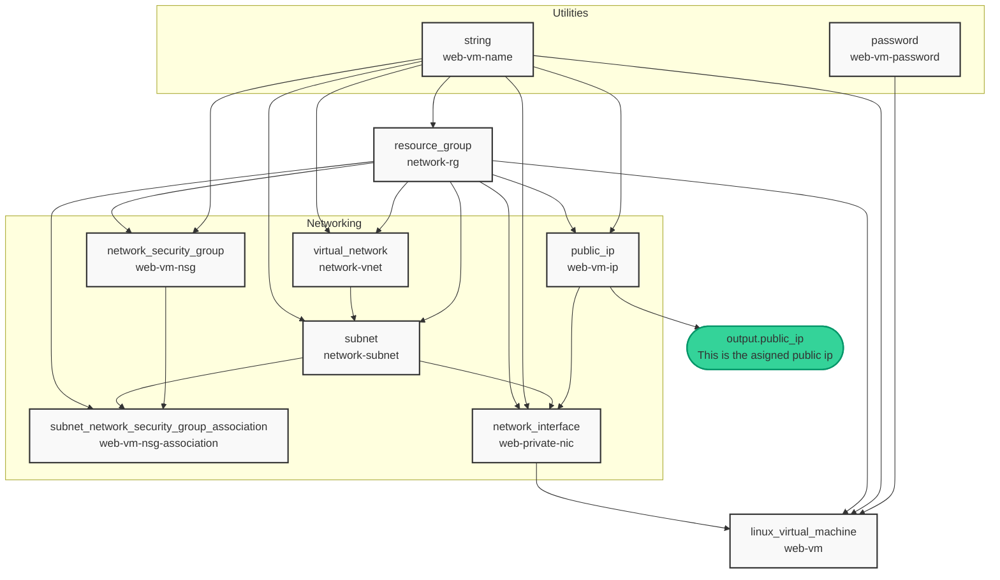
```mermaid
flowchart TD
    random_password_web_vm_password["password\nweb-vm-password"]
    class random_password_web_vm_password randomResource
    random_string_web_vm_name["string\nweb-vm-name"]
    class random_string_web_vm_name randomResource
    azurerm_resource_group_network_rg["resource_group\nnetwork-rg"]
    class azurerm_resource_group_network_rg azureResource
    azurerm_virtual_network_network_vnet["virtual_network\nnetwork-vnet"]
    class azurerm_virtual_network_network_vnet azureResource
    azurerm_subnet_network_subnet["subnet\nnetwork-subnet"]
    class azurerm_subnet_network_subnet azureResource
    azurerm_network_security_group_web_vm_nsg["network_security_group\nweb-vm-nsg"]
    class azurerm_network_security_group_web_vm_nsg azureResource
    azurerm_subnet_network_security_group_association_web_vm_nsg_association["subnet_network_security_group_association\nweb-vm-nsg-association"]
    class azurerm_subnet_network_security_group_association_web_vm_nsg_association azureResource
    azurerm_public_ip_web_vm_ip["public_ip\nweb-vm-ip"]
    class azurerm_public_ip_web_vm_ip azureResource
    azurerm_network_interface_web_private_nic["network_interface\nweb-private-nic"]
    class azurerm_network_interface_web_private_nic azureResource
    azurerm_linux_virtual_machine_web_vm["linux_virtual_machine\nweb-vm"]
    class azurerm_linux_virtual_machine_web_vm azureResource
    output_public_ip(["output.public_ip\nThis is the asigned public ip "])
    class output_public_ip output

    random_string_web_vm_name --> azurerm_resource_group_network_rg
    random_string_web_vm_name --> azurerm_virtual_network_network_vnet
    azurerm_resource_group_network_rg --> azurerm_virtual_network_network_vnet
    random_string_web_vm_name --> azurerm_subnet_network_subnet
    azurerm_virtual_network_network_vnet --> azurerm_subnet_network_subnet
    azurerm_resource_group_network_rg --> azurerm_subnet_network_subnet
    azurerm_resource_group_network_rg --> azurerm_network_security_group_web_vm_nsg
    random_string_web_vm_name --> azurerm_network_security_group_web_vm_nsg
    azurerm_resource_group_network_rg --> azurerm_subnet_network_security_group_association_web_vm_nsg_association
    azurerm_subnet_network_subnet --> azurerm_subnet_network_security_group_association_web_vm_nsg_association
    azurerm_network_security_group_web_vm_nsg --> azurerm_subnet_network_security_group_association_web_vm_nsg_association
    azurerm_resource_group_network_rg --> azurerm_public_ip_web_vm_ip
    random_string_web_vm_name --> azurerm_public_ip_web_vm_ip
    azurerm_resource_group_network_rg --> azurerm_network_interface_web_private_nic
    random_string_web_vm_name --> azurerm_network_interface_web_private_nic
    azurerm_subnet_network_subnet --> azurerm_network_interface_web_private_nic
    azurerm_public_ip_web_vm_ip --> azurerm_network_interface_web_private_nic
    azurerm_network_interface_web_private_nic --> azurerm_linux_virtual_machine_web_vm
    azurerm_resource_group_network_rg --> azurerm_linux_virtual_machine_web_vm
    random_string_web_vm_name --> azurerm_linux_virtual_machine_web_vm
    random_password_web_vm_password --> azurerm_linux_virtual_machine_web_vm
    azurerm_public_ip_web_vm_ip --> output_public_ip

    subgraph UTILITIES["Utilities"]
        random_password_web_vm_password
        random_string_web_vm_name
    end

    subgraph NETWORKING["Networking"]
        azurerm_virtual_network_network_vnet
        azurerm_subnet_network_subnet
        azurerm_network_security_group_web_vm_nsg
        azurerm_subnet_network_security_group_association_web_vm_nsg_association
        azurerm_public_ip_web_vm_ip
        azurerm_network_interface_web_private_nic
    end


    classDef default fill:#f9f9f9,stroke:#333,stroke-width:2px
    classDef aws fill:#FF9900,stroke:#232F3E,stroke-width:2px,color:#fff
    classDef azure fill:#0072C6,stroke:#003366,stroke-width:2px,color:#fff
    classDef gcp fill:#4285F4,stroke:#0F9D58,stroke-width:2px,color:#fff
    classDef moduleResource fill:#6B7280,stroke:#374151,stroke-width:2px,color:#fff
    classDef dataResource fill:#9CA3AF,stroke:#4B5563,stroke-width:2px,color:#fff
    classDef variable fill:#FCD34D,stroke:#D97706,stroke-width:2px
    classDef output fill:#34D399,stroke:#059669,stroke-width:2px
    classDef terragruntConfig fill:#5C4EE5,stroke:#4338CA,stroke-width:3px,color:#fff,font-weight:bold
    classDef terragruntDep fill:#8B5CF6,stroke:#7C3AED,stroke-width:2px,stroke-dasharray: 5 5,color:#fff
    classDef terragruntInput fill:#EC4899,stroke:#BE185D,stroke-width:2px,color:#fff
```

##### Graph Walk

Terraform walks the dependency graph using a parallel depth-first traversal, following these core rules:

* **Traversal Logic**
  * **Execution Order**: A node is processed as soon as all of its dependencies have been successfully walked.
  * **Parallelism**: To prevent overwhelming local system resources, Terraform uses a semaphore to limit concurrent operations.
  * **Concurrency Limits**: By default, up to 10 nodes are processed simultaneously. This can be adjusted using the `-parallelism` flag during plan, apply, or destroy.
* **Usage & Rate Limiting**
  * **Advanced Tuning**: Modifying the parallelism count is rarely necessary for standard workflows but can be useful for debugging or specific edge-case resource constraints.
  * **API Rate Limits**: This setting is not intended to manage Cloud Provider API limits. Providers (like AWS) typically handle rate limiting internally via retries and exponential backoff at the client level.

When a node fails during a parallel walk, Terraform follows a "graceful stop" procedure to prevent further issues while leaving the state as clean as possible.

* **Failure Handling Mechanics**
  * **Immediate Halt**: Once a node returns an error, Terraform stops initiating new nodes that depend on that failed resource.
  * **Independent Branches**: Nodes in separate, unrelated branches of the graph continue to execute until they either finish or hit their own dependencies.
  * **State Integrity**: Terraform saves the state for every successfully completed resource immediately. This ensures that if you run the command again, Terraform knows exactly what was finished and what still needs work.
  * **Downstream Blocking**: Any resource that lists the failed node as a dependency is marked as "skipped." Because the prerequisite failed, the downstream resource cannot be safely created or modified.

#### Manual / Implicit Dependencies

```hcl
rovider "aws" {
  region = var.aws_region
}

data "aws_ami" "amazon_linux" {
  most_recent = true
  owners      = ["amazon"]

  filter {
    name   = "name"
    values = ["amzn2-ami-hvm-*-x86_64-gp2"]
  }
}

resource "aws_instance" "example_a" {
  ami           = data.aws_ami.amazon_linux.id
  instance_type = "t2.micro"
}

resource "aws_instance" "example_b" {
  ami           = data.aws_ami.amazon_linux.id
  instance_type = "t2.micro"
}

resource "aws_eip" "ip" {
  vpc      = true
  instance = aws_instance.example_a.id
}
```

The resource `aws_instance.example_a` has uses the data source `data.aws_ami.amazon_linux.id` to specify the ami to use for creating the image, this assignment creates a manual dependency. T

Similarly resource `aws_eip.ip` assigns the instance field the value of `aws_instance.example_a.id` which also creates a manual dependency.

These two depenencies requires the data source `data.aws_ami.amazon_linux` and the resource `aws_instance.example_a` MUST be created before the can be used as a reference.

#### Explicit Dependencies

Sometimes there are dependencies between resources that are not visible to Terraform, however. The `depends_on` argument is accepted by any resource or module block and accepts a list of resources to create explicit dependencies for.

```hcl
resource "aws_s3_bucket" "example" { }

resource "aws_instance" "example_c" {
  ami           = data.aws_ami.amazon_linux.id
  instance_type = "t2.micro"

  depends_on = [aws_s3_bucket.example]
}

module "example_sqs_queue" {
  source  = "terraform-aws-modules/sqs/aws"
  version = "3.3.0"

  depends_on = [aws_s3_bucket.example, aws_instance.example_c]
}

```

The `depends_on` can be used with the following blocks:

* `check`
* `data`
* `ephemeral`
* `module`
* `output`
* `resource`

Terraform generates a dependency graph for determining which resources need to be built 1st, 2nd, 3rd, etc. The `depends_on` can be used to alter dependencies.

* The `lifecycle` block along with `create_before_destroy` and `prevent_destroy` are additional tools in the lifecycle tool belt
* Items with no dependencies are built in parallel to speed up the provisioning process
* By default, up to 10 concurrent operations can be run at the same time
* This can be changed with the `-parallelism` flag on `plan`, `apply`, & `destroy` commands

### 4g. Validate configuration using custom conditions

Validation helps you verify that your Terraform configuration works as you intend.

Using different types of validation you can:

* Verify input variables meet specific requirements.
* Prevent incorrect outputs from writing to your state.
* Ensure resources and data sources are configured correctly after Terraform applies them.
* Verify the broader behavior of your infrastructure.
* Document assumptions about your infrastructure.
* Use HCP Terraform to regularly verify your infrastructure.

#### Input Validation

Use the `validation` block within an variable block to add validation of input variables, such as:

* specific formatting
* falls within specific acceptable range of values
* prevent terraform operations if variable is misconfigured

Example:

```hcl
variable "image_id" {
  type        = string
  description = "The id of the machine image (AMI) to use for the server."

  validation {
    condition     = length(var.image_id) > 4 && substr(var.image_id, 0, 4) == "ami-"
    error_message = "The image_id value must be a valid AMI id, starting with \"ami-\"."
  }
}
```

#### Preconditions and Postconditions

**`precondition` block**:

* use when you want to verify your terraform configurations assumptions for resources, data sources, and outputs before terraform creates them.
* take precendence over any argument errors raised from providers on incorrectly configured resources, data sources, and outputs
* evaluated when terraform builds a plan
* an output block can also include a `precondition` to verify a module's output.
* when preconditions fail, terraform halts and exposes the error message defined

```hcl
resource "aws_instance" "example" {
  instance_type = "t3.micro"
  ami           = data.aws_ami.example.id

  lifecycle {
    # The AMI ID must refer to an AMI that contains an operating system
    # for the `x86_64` architecture.
    precondition {
      condition     = data.aws_ami.example.architecture == "x86_64"
      error_message = "The selected AMI must be for the x86_64 architecture."
    }
  }
}

output "instance_public_ip" {
  value = aws_instance.web.public_ip

  precondition {
    condition     = length([for rule in aws_security_group.web.ingress : rule if rule.to_port == 80 || rule.to_port == 443]) > 0
    error_message = "Security group must allow HTTP (port 80) or HTTPS (port 443) traffic."
  }
}
```

**`postcondition` block**:

* use when you want to validate the guarantees your resources and data sources must meet for your configuration to run
* evaluated after planning and applying changes to resources, or after reading from a data source
* help preventing cascading changes to other dependent resources
* serves as static guardrails to enforce mandatory configuration aspects on your `data` and `resource` blocks


```hcl
data "aws_ami" "example" {
  id = var.aws_ami_id

  lifecycle {
    # The AMI ID must refer to an existing AMI that has the tag "nomad-server".
    postcondition {
      condition     = self.tags["Component"] == "nomad-server"
      error_message = "tags[\"Component\"] must be \"nomad-server\"."
    }
  }
}
```

#### Checks

Use the `check` block to validate your infrastructure outside of the typical resource lifecycle.
Executes as the last step of `plan` or `apply` operation, after Terraform has planned or provisioned your infrastructure.
When a `check` blocks assertion fails, it does not halt operations and terraform reports a warning

Use the `check` block to complete the following processes:

* Validate resources, data sources, variables, or outputs in your configuration.
* Validate the behavior of your infrastructure as a whole.
* Verify infrastructure configuration without blocking operations.
* Perform continuous validation in HCP Terraform.

```hcl
check "health_check" {
  data "http" "terraform_io" {
    url = "https://www.terraform.io"
  }

  assert {
    condition = data.http.terraform_io.status_code == 200
    error_message = "${data.http.terraform_io.url} returned an unhealthy status code"
  }
}
```

#### HCP Terraform Continuous Validation

* Using health checks in HCP on a workspace, HCP Terraform continously validates `check`, `precondition`, and `postcondition` blocks to verify the configurations and your infrastructure
* Order of validation:
  1. Input variables are validate immediately before generating a plan
  2. Executes preconditions after a plan is generated and before created the resources, data sources, or outputs
  3. Executes postconditions after planning and applying changes
  4. Executes checks at the end of plan and apply operations and every time health assessments run on a workspace in HCP Terraform.

### 4h. Understand best practices for managing sensitive data, including secrets management with vault

Using the `sensitive=true` property on _input_ and _output_ variables will only restrict the value from being displayed in the output, the plain-text value **WILL** be stored in state. Hence it is recommended to use a backend that supports encrypt at rest and in transit.

Use `ephemeral=true` so that values are available at runtime, but Terraform omits them from state and plan files entirely. Terraform provides four ways to define ephemeral values in your configuration:

* The ephemeral argument on variables and child module outputs
* The ephemeral block
* A write-only argument on a managed resource

_HCP Terraform Cloud_ supports encrypt at rest and in transit by default and the same goes for other remote backends like `s3`, `azurerm` and `gcs`; however for `s3` you need to enable the `encrypt` option.

#### Secret Inject via Vault

To inject secrets from HashiCorp Vault into your Terraform configuration, you move away from hardcoded variables and instead use the Vault Provider. This allows you to fetch sensitive data dynamically during the plan or apply phases.

##### Vault

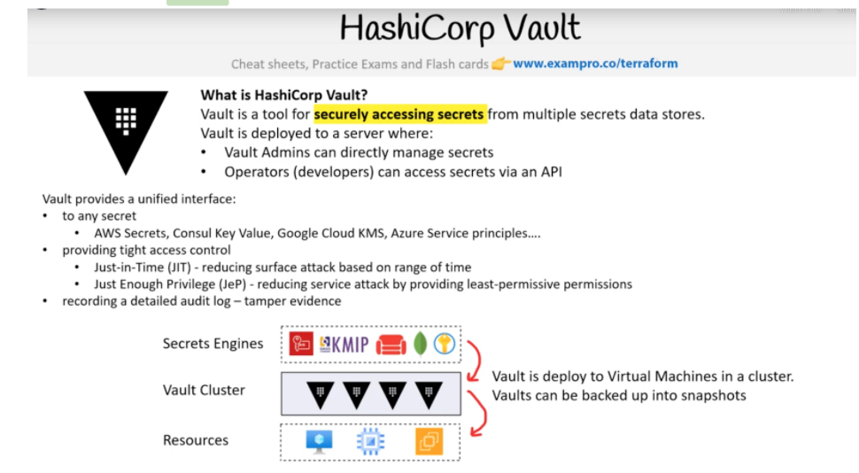

Vault is a tool for securely accessing secrets from multiple secrets data stores.

Vault is deployed to a server where:

* Vault Admins can directly manage secrets
* Operators (developers) can access secrets via an API

Vault provides a unified interface:

* to any secret
  * AWS Secrets, Consul Key Value, Google Cloud KMS, Azure Service principles….
* providing tight access control
  * Just-in-Time (JIT) - reducing surface attack based on range of time
  * Just Enough Privilege (JeP) - reducing service attack by providing least-permissive permissions
* recording a detailed audit log – tamper evidence

Use the `vault` provider block in the terraform configuration.

```hcl
provider "vault" {
}
```

The provider block has the following arguments:

* **address**: (REQUIRED) URL of the Vault Server. This can be retrieved from the `VAULT_ADDR` environment variable.
* **add_addr_to_env**: (Optional) if `true` the environment variable `VAULT_ADDR` in the _Terraform_ process environment will be set to the value of the `address` argument from the configuation. This is `false` by default.
* **token**: (Optional) Used by Terraform to authenticate to Vault. Can be retrieve by the `VAULT_TOKEN` environment variable. If not set Terraform will attempt to read it from `~/.vault-token`

Other provider arguments can be found in the [Vault Provider Documentation](https://registry.terraform.io/providers/hashicorp/vault/latest/docs#provider-arguments)

##### The Workflow: Vault to Terraform

Instead of passing a .tfvars file (which can be leaked), Terraform acts as a Vault client. It authenticates, reads a path, and maps the JSON response to a local complex object.

1. Configure the Provider
First, tell Terraform how to talk to your Vault instance.

```hcl
provider "vault" {
  address = "https://vault.example.com:8200"
  # Authentication is usually handled via VAULT_TOKEN env var
}
```

2. Fetch the Secret (The "Conversion" Step)

Vault stores data as KV (Key-Value) pairs. When Terraform reads a secret, it returns it as a Map, which you can then treat as a complex object.

```hcl
data "vault_generic_secret" "db_creds" {
  path = "secret/database/config"
}

locals {
  # Vault returns data as a map[string]interface{}
  # We access it directly or cast it if needed
  username = data.vault_generic_secret.db_creds.data["username"]
  password = data.vault_generic_secret.db_creds.data["password"]
}
```

3. Injecting into Resources
Once converted into a local variable, you can inject these secrets into your cloud resources. Terraform will automatically mask these values in the CLI output.

```hcl
resource "aws_db_instance" "default" {
  username = local.username
  password = local.password
  # ... other config
}
```

Why this is the best option:

* No Plaintext → Secrets never live in your version control (`.tf` files).
* Ephemeral →Secrets are fetched into memory at runtime.
* Complex Mapping → If your Vault secret contains a JSON blob, you can use `jsondecode(data.vault_generic_secret.example.data["json_key"])` to turn it into a full Terraform object instantly.

**Links**:

* Sensitive Data In State → https://developer.hashicorp.com/terraform/language/manage-sensitive-data
* State security best practices → https://developer.hashicorp.com/terraform/language/v1.12.x/manage-sensitive-data#state-security-best-practices
* Protective Sensitve Input Variables → https://developer.hashicorp.com/terraform/tutorials/configuration-language/sensitive-variables#sensitive-values-in-state

### 4a. Describe when to use terraform import to import existing infrastructure into to your Terraform state

**Command import**

* Used to import existing resources into Terraform. Define a placeholder for your imported resource in the configuration file.
* You can leave the body blank and fill it in after importing. It will not be auto-filled.
* `terraform import {RESOURCE_ADDRESS} {ID}`
* Proceed to importing your import file.
* The command can only import one resource at a time.
* Each resource in Terraform must implement some basic logic to become importable therefore not all resources are importable, you need to check the bottom of resource documentation for support


Usage:

`terraform import [options] RESOURCE_ADDRESS ID`, Terraform will import the existing infrastructure resource at the specified `RESOURCE_ADDRESS ID`.

Options:
* `-h,-help`: gives more details about the command
* `-config={path}`:
  * Path to the directory of Terraform configuration files. Defaults to current directory.
* `-input=true`:
  * Whether to ask for input for providor config
* `-lock=false`:
  * Don't hold a state lock during the operation. **This is dangerous if others might concurrently run commands against the same workspace.**
* `lock-timeout=0s`:
  * Duration to retry state locking
* `-no-color`:
  * output won't be in-color
* `-parallelism=n`:
  * Limit the number of concurrent operation as Terraform walks the graph. Defaults to 10.
* `-provider={provider}`:
  * **DEPRECATED**
  * Override the current provider configurations
* `-var 'foo=bar'`:
  * Set a variable in the Terraform configuration
* `-var-file={path}`:
  * Set variables in the terraform configuration from a variable file.
  * `terraform.tfvars` is loaded first
  * `*.auto.tfvars` is loaded second, alphabetically
  * files specified using `-var-file`, will override any variables auto loaded.
* `-ignore-remote-version`:
    * For configurations using the Terraform Cloud CLI integrations or remote backend only
    * Overrides checking that the local and remote terraform version agree, making an operation proceed even when there is a mismatch
    * recommend **NOT** to be be used unless absolutely necessary
* Legacy State Flags:
    * `-state={FILENAME}`
        * overrides the state filename when reading the prior state snapshot
        * if used without `-state-out`, terraform will use the specified filename for both
    * `-state-out={FILENAME}`
        * overrides the state filename when writing new state snapshots
        * 
    * `-backup={FILENAME}`

**Examples**
Import an AWS instance in the `aws_instance` resource named `foo`:

`terraform import aws_instance.foo i-abcd1234`

Importing in an AWS instance in the `aws_instance` resource named `bar` into a module named `foo`:

`terraform import module.foo.aws_instance.bar i-abc1234`

Import a resource configured with count:

`terraform import 'aws_instance.baz[0]' i-abcd1234`

Import a resource configured with for_each:

`terraform import 'aws_instance["example"]' i-abc1234`


### Import Block

Available in Terraform v1.5+

```hcl
import {
  to = aws_instance.my_instance
  id = "id-123345"
}

resource "aws_instance" "my_instance" {
  name = "my_instance"
  ....
}
```

Will import the resource specified in the _import_ block into managed state and assign it to the managed resource. You can also use the `terraform plan -generate-config-out=generated.tf` to auto-generate the terraform configuration (NOTE this is Experimental only). You can then use this generated TF config to add to you root module.

* Command: import --> https://www.terraform.io/docs/cli/commands/import.html
* Import Terraform Configuration -->https://learn.hashicorp.com/tutorials/terraform/state-import

### 4b. Use terraform state to view Terraform State

Terraform uses _state data_ to map real objects to resources in the configuration, which allows it to modify an existing object when the corresponding declaration changes. Terraform will store this mapping in a file called `terraform.tfstate`, which is a JSON data structure with a one-to-one mapping from resources instances to remote objects.

State is updated automatically during plan and apply, however there are times when you need to modify state directly. Use the `terraform state` command for these 
* Output Values → https://www.terraform.io/docs/language/values/outputs.htmlscenerios.

**Command state**

Used for advanced state management.

* `terraform state list`: 
    * displays the resources addresses for every resource Terraform knows about.
    * Option flags:
        * `-state={path}`: path to the state file
        * `-id={id}`: ID of resources to show
* `terraform state show {ADDRESS}`
    * displays detailed state data about one resource.
    * Option flags:
        * `-h,-help`: gives more details about the command
        * `-state={path}`: path to the state file
* `terraform refresh`
    * updates state to match real-world conditions. 
    * Done automatically during plan and apply.
    * This command is **DEPRECATED** use the `-refresh-only` flag during `terraform plan` or `terraform apply`
* `terraform state mv {SOURCE} {DESTINATION}`
    * if the resource specified by `{SOURCE}` is found in state, terraform will move the remote object to be tracked instead by `{DESTINATION}`.
    * Use the `-dry-run` flag to report all the resources that match the given address without actually "forgetting" any of them.
* `terraform state rm {ADDRESS}`
    * removes a resource from being tracked by Terraform. **IT DOES NOT destroy the remote object.**
* `terraform state replace-provider {FROM} {TO}`
    * updates all resources using the _FROM_ provider, setting the provider to the specified _TO_ provider.
    * accepts the following options:
        * `-auto-approve`
            * skip interactive approval
        * `lock=false`
            * dont hold a state lock during the operation
            * dangerous if others might concurrently run commands against the same workspace
        * `lock-timeout=0s`
            * duration to retry a state lock
* `terraform state pull`: download the state from its current location, upgrade the local copy to the latest state file version, output the raw format to stdout.
* `terraform state push {PATH}`: manually upload a local state file to remote state.
  * use the `-force` flag to tell Terraform to ignore any safety checks and force the remote state override.
* `terraform force-unlock {LOCK_ID}`: Removes the lock on the state file, _LOCK_ID_.


All `terraform state` subcommands except read-only ones (`show`, `list`) will generate a backup file of the current state before making modifications.

**Removed Blocks**
As of Terraform v1.7+ a new block was added name `removed` which allows you to remove a resource from your Terraform configuration without destroying the real infrastructure object it manages. In this case, the resource will be removed from the Terraform state, but the real infrastructure object will not be destroyed.

Example:

```
removed {
    from = aws_instance.example

    lifecycle {
        destroy = false
    }
}
```

The `from` argument is the address of the resource you want to remove, the `lifecycle` block is required, and the `destroy` argument determines whether terraform will attempt to destroy the object managed by the resource or not.

**Resource Block Options**

The resource block supports conditional checks `precondition` and `postcondition` as well as `timeouts`. The conditions specify assumptions and guarantees about how the resources operates and the timeouts indicate the allowed duration of an operation.

Example

```
resource "aws_instance" "example" {
  instance_type = "t2.micro"
  ami           = "ami-abc123"

  lifecycle {
    # The AMI ID must refer to an AMI that contains an operating system
    # for the `x86_64` architecture.
    precondition {
      condition     = data.aws_ami.example.architecture == "x86_64"
      error_message = "The selected AMI must be for the x86_64 architecture."
    }
  }

  timeouts {
    create
  }
}
```

* State Command --> https://developer.hashicorp.com/terraform/cli/commands/state
* Manage Resources in Terraform State --> https://learn.hashicorp.com/tutorials/terraform/state-cli

### 4c. Describe when to enable verbose logging and what the outcome/value is

Set the `TF_LOG` environment variable to enable logging. Use one of the following log levels `TRACE`, `DEBUG`, `INFO`, `WARN` or `ERROR` to change the verbosity of the logs.

Setting `TF_LOG` to `JSON` will output the logs at the `TRACE` level or higher and use JSON encoding as the formatting.

Alternatively your can enable logging for Terraform itself and the provider plugins:
* `TF_LOG_CORE`:
  * uses same log levels as `TF_LOG`
  * enables logging for Terraform Core
* `TF_LOG_PROVIDER`:
  * uses same log levels as `TF_LOG`
  * enables logging for the provider plugins

To persist logged output you can set `TF_LOG_PATH` in order to force the log to always be appended to a specific file when logging is enabled. Note that even when `TF_LOG_PATH` is set, `TF_LOG` must be set in order for any logging to be enabled.

If Terraform ever crashes (a "panic" in the Go runtime), it saves a log file with the debug logs from the session as well as the panic message and backtrace to crash.log
This log file is meant to be passed along to the developers via a GitHub Issue.
As a user, you're not required to dig into this file.

* Debugging Terraform --> https://developer.hashicorp.com/terraform/internals/debugging
* Troubleshoot Terraform --> https://learn.hashicorp.com/tutorials/terraform/troubleshooting-workflow#enable-terraform-logging

[Back to Exam Guide](README.md)