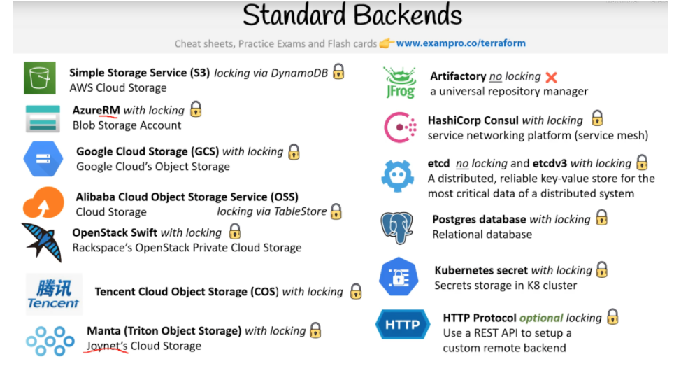

# Hashicorp Terraform Associate Cloud Engineer (003) Certification

## 6. Terraform State Management

## 6a. Describe the `local` backend

#### Backends

Each Terraform configuration can specify a backend, which defines where and how operations are performed, where state snapshots are stored.

They are defined using the `backend` block withing the Terraform Settings block.

```hcl
terraform {
  backend "remote" {
    ....
  }
}
```

Terraform's backends are divided into two types:

* **Standard Backends**
  * only store state
  * does not perform terraform operations eg. `terraform apply`
    * To perform operations you use the CLI on your local machine
  * third-party backends are Standard backends e.g. _AWS S3_
  * Does not require terraform cloud or workspace
* **Enhanced Backends**
  * can both store state and perform _terraform_ operations
  * subdivided:
    * **local**
      * files and data are stored on the local machine executing _terraform_ commands.
    * **remote**
      * files and data are stored in the cloud (e.g.; _HCP Terraform Cloud_, _AWS S3_, etc)



#### Enhanced Backends - "default" Local Backends

The `local` backend:

* stores state on the local filesystem
* locks that state using system APIs
* performs operations locally
* default if nothing is specified

The default state file is name `terraform.tfstate`

By default, you are using the backend state when you have not specified backend.

```hcl
terraform {
  // empty means local by default and the .tfstate file will be written in the current directory.
}
```

You can specify the backend with argument "local", and you can change the path to the local file and working_directory.

```hcl
terraform {
  backend "local" {
    path = "relative/path/to/terraform.tfstate"
  }
}
```

All though you can set a backend to reference another state file so you can read its outputted values. This is a way of cross-referencing stack as shown below however this serves as an anti-pattern and should be avoid.

```hcl
data "terraform_remote_state" "vpc" {
  backend = "local"
  config = {
    path = "${path.module}/vpc/terraform.tfstate"
  }
}

resource "aws_instance" "my_server" {
  ...
  subnet_id = data.terraform_remote_state.vpc.outputs.subnet_id
}
```

Instead use cloud native data sources:

```hcl
# Use tags to find the VPC instead of reading a state file
data "aws_vpc" "shared" {
  filter {
    name   = "tag:Name"
    values = ["production-vpc"]
  }
}

resource "aws_subnet" "example" {
  vpc_id = data.aws_vpc.shared.id
  # ...
}
```

Option configuration arguments:

* `state={FILENAME}`: overrides the state filename when reading the prior state snapshot.
* `state-out={FILENAME}`: overrides the state filename when writing new state snapshots.
* `backup={FILENAME}`: overrides the default filename that the local backend would normally choose dynamically to create backup files when it writes new state.

**Links**:

* Backends → https://developer.hashicorp.com/terraform/language/backend
* Local → https://developer.hashicorp.com/terraform/language/backend/local
* Migrate State to Terraform Cloud → https://developer.hashicorp.com/terraform/tutorials/cloud/cloud-migrate#set-up-the-remote-backend

## 6b. Describe State Locking

Terraform will lock your state for all operations that could write state. This prevents others from acquiring the lock and potentially corrupting your state
State locking happens automatically on all operations that could write state, you won't see any message that it is happening.

If state locking fails you can disable state locking for most commands with the `-lock` flag but it is not recommended.

Terraform does not output when a lock is complete,
however, If acquiring the lock is taking longer than expected, Terraform will output a status message.

Terraform has a `force-unlock` command to manually unlock the state if unlocking failed.

If you unlock the state when someone else is holding the lock it could cause multiple writes.

Force unlock should only be used to unlock your own lock in the situation where automatic unlocking failed.

To protect you, the `force-unlock` command requires a unique lock ID
Terraform will output this lock ID if unlocking fails. This lock ID acts as a [nonce](https://en.wikipedia.org/wiki/Cryptographic_nonce), ensuring that locks and unlocks target the correct lock.

State lock file `.terraform.tfstate.lock.hcl`

Not all backends support locking, Local, TFC, AWS S3 (with some tweaks), and several others do ([see docs for which ones do/don't](https://developer.hashicorp.com/terraform/language/settings/backends/configuration)).

You can manually retrieve remote state with `terraform state pull`
You can manually write state with `terraform state push`.... but don't ever ever ever do this without proper supervision and guidance and backups.

**Links**:

* State Locking → https://developer.hashicorp.com/terraform/language/state/locking

## 6c. Configure remote state using the backend block

### Backend Configuration

Each Terraform configuration can specify a backend, which defines where and how operations are performed and where state snapshots are stored.

You do not need to configure a backend when using _Terraform Cloud_ because it automatically manages state in the workspaces associated with your configuration. If your configuration includes a `cloud` block, it cannot include a `backend` block.

Limitations:

* 1 cloud, 1 backend block
* Cannot use interpolation (SO NO VARIABLES)

Backend Types:

* `local`
* `cloud` (HCP Terraform)
* `azurerm`
* `s3`
* `GCS`

**Cloud Block**:

```hcl
terraform {
  cloud {
    organization = "my-org"
    hostname = "app.terraform.io" # Optional; defaults to app.terraform.io

    workspaces {
      project = "networking-development"

      tags = {
        layer = "networking"
        source = "cli"
      }
    }
  }
}
```

#### Partial Configuration

You do not need to specify every required argument in the backend configuration, omitting certain things for security reasons may be desirable and can be set automatically using automation scripts.

Terraform requires a minimum empty backend configuration:

```hcl
terraform {
  backend "consul" {}
}
```

The remaining arguments **MUST** be provided as part of the initialization process, using one of the following methods.

**File**:

The backend configuration file contains the content of the `backend` block as attributes:

```text
address = "demo.consul.io"
path    = "example_app/terraform_state"
scheme  = "https"
```

The recommended file name pattern is `*.backendname.tfbackend` (e.g `config.consol.tfbackend`).

Using the `terraform init` you pass the file using the `-backend-config={PATH}` flag (e.g. `terraform init -backend-config=config.consol.tfbackend`).

**Command-line key/value pairs**:

The same settings from the _File_ approach can be passed on the command line:

```bash
terraform init \
    -backend-config="address=demo.consul.io" \
    -backend-config="path=example_app/terraform_state" \
    -backend-config="scheme=https"
```

**Interactively**:

If nothing is passed to _Terraform_ during `init`, it will ask for the required values unless input is disabled.

### Changing Configuration

You can change the backend configuration (e.g. `consol` to `s3`) at anytime. Terraform will require a _reinitialization_ (`terraform init --reconfigure`) in order to download the necessary plugins and will ask to migrate the existing state to the new configuration.

**Links**:

* Backend Configuration → https://developer.hashicorp.com/terraform/language/backend
* Remote State Storage → https://developer.hashicorp.com/terraform/tutorials/aws-get-started/aws-hcp-terraform

## 6d. Manage resource drift and Terraform state

### Refactoring

Reasons for refactoring:

* Long Terraform applies:
  * Your configuration has grown over time and become cumbersome to manage. Large, monolithic configuration can cause Terraform plan and apply operations to take a long time to complete and cause unintended changes.
* Changes to management lifecycles:
  * Managing frequently updated resources separately from infrequently updated resources can help simplify your operations and reduce the blast radius of unintended changes.
* Changes to resource ownership:
  * In some organizations, teams may split the responsibility of maintaining different parts of the architecture. In these cases, it is common for teams to refactor the configuration and state to match their area of ownership and scope.
* Reusable module opportunity:
  * You have identified a subsection of your configuration that would make for a good module. If you create the same set of resources in multiple configurations, we recommend grouping those resources into a module and reusing it across your organization.

Before refactoring you should build a plan and identify any and all dependencies on the portions that you plan to refactor.

It is recommended to recreate stateless resources in a new Terraform configuration if you can do so without incurring downtime or extra cost. Stateful resources, such as databases and object stores, are more complicated to migrate. In many cases, you cannot delete and recreate them, or it may be complex and expensive to backup and restore the data. In this case, you can migrate your resources by moving them between state files.

There are several options for refactoring:

* Remove and Import (`removed` and `import` blocks)
* Move a resource to a new address (`moved` block)
* Move resources directly to a new state file (`terraform state mv` command)

#### Remove and Import Resources

The `removed` block instructs Terraform to remove a resource from state which in turns means that Terraform no longer manages the actual infrastructure that the configuration represents.

The `removed` block has the following structure:

```hcl
removed {
  from = "<resource.address>"
  lifecycle {
    destroy = < true || false >
  }
  connection {
    <connection-settings>
  }
  provisioner "<TYPE>" {
    when = destroy
    <provisioner-type-arguments>
  }
}
```

Example:

```hcl
- resource "aws_instance" "example" {
-     instance_type = "t3.micro"
-     ami = data.aws_ami.example.id
- }

+ removed {
+   from = aws_instance.example
+   lifecycle {
+     destroy = false
+   }
+ }

```

For `import` command `import` block flows, see [Domain 7a. Import existing infrastructure into your Terraform workspace](./Domain-7.md#7a-import-existing-infrastructure-into-your-terraform-workspace)

#### Move Resources to new resource address

Terraform will compare the current state with new configuration, correlating by each module or resource's unique address. Therefore by default Terraform understands moving or renaming an object as an intent to destroy the object at the old address and to create a new object at the new address.

Use the `moved` block to record the old and new addresses for each resource instance. This will direct Terraform to treat existing objects at the old address as if they had originally been created at the corresponding new address.

This method is the preferred method over using `terraform state mv` command

```hcl
moved {
  from = aws_instance.old_instance
  to   = aws_instance.new_instance
}
```

See [here](https://developer.hashicorp.com/terraform/language/modules/develop/refactoring) for more details on the `moved` block.

NOTE: We strongly recommend you retain all moved blocks in your configuration as a record of your changes. Removing a moved block plans to delete that existing resource instead of moving it.

#### `refresh-only` Mode

The `–refresh-only` flag for terraform plan or apply allows you to refresh and update your state file without making changes to your remote infrastructure. It replaces the now deprecated and error prone `terraform refresh` command because it was not safe since it did not give you an opportunity to review proposed changes before updating the state file.

The terraform refresh command is an alias for the refresh only and auto approve:

* `terraform apply -refresh-only -auto-approve` or `terraform plan -refresh-only`

**Scenario**:

Imagine you create a terraform script that deploys a Virtual Machine on AWS and you ask an engineer to terminate the server, and instead of updating the terraform script they mistakenly terminate the server via the AWS Console. This is change is referred to as _drift_, when your expected resources are in a different state that your expected stated.

Running `terraform apply`:

* Terraform will notice that the VM is missing
* Terraform will propose to create a new VM
* The `State File` is correct
* Changes the infrastructure to match state file.

Running `terraform apply –refresh-only`:

* Terraform will notice that the VM you provisioned is missing.
* With the `refresh-only` flag that the missing VM is intentional
* Terraform will propose to delete the VM from the state file
* The State File is wrong
* Changes the state file to match infrastructure

#### Replacing Selected Resources

The `replace={RESOURCE_ADDRESS}` option instructs Terraform to replace the object with the given resource address

* `terraform plan -replace={RESOURCE_ADDRESS}` or `terraform apply -replace={RESOURCE_ADDRESS}`

#### Targeted Plan and Apply

The `-target` option instructs Terraform to focus it's attention on only a subset of resources. You can use resource address syntax to specify the constraint. Terraform interprets the resource address as follows:

* If the given address identifies one specific resource instance, Terraform will select that instance alone. For resources with either count or for_each set, a resource instance address must include the instance index part, like `aws_instance.example[0]`.

* If the given address identifies a resource as a whole, Terraform will select all of the instances of that resource. For resources with either count or for_each set, this means selecting all instance indexes currently associated with that resource. For single-instance resources (without either count or for_each), the resource address and the resource instance address are identical, so this possibility does not apply.

* If the given address identifies an entire module instance, Terraform will select all instances of all resources that belong to that module instance and all of its child module instances.

Once Terraform has selected one or more resource instances that you've directly targeted, it will also then extend the selection to include all other objects that those selections depend on either directly or indirectly.

This targeting capability is provided for exceptional circumstances, such as recovering from mistakes or working around Terraform limitations. It is not recommended to use `-target` for routine operations, since this can lead to undetected configuration drift and confusion about how the true state of resources relates to configuration.

Instead of using `-target` as a means to operate on isolated portions of very large configurations, prefer instead to break large configurations into several smaller configurations that can each be independently applied.

Example : `terraform plan -target={RESOURCE_ADDRESS}` or `terraform apply -target={RESOURCE_ADDRESS}`

**Links**:

* Command: refresh --> https://www.terraform.io/docs/cli/commands/refresh.html
* Manage Resource Drift --> https://learn.hashicorp.com/tutorials/terraform/resource-drift
* Use Refresh-Only Mode to sync Terraform State --> https://learn.hashicorp.com/tutorials/terraform/refresh
