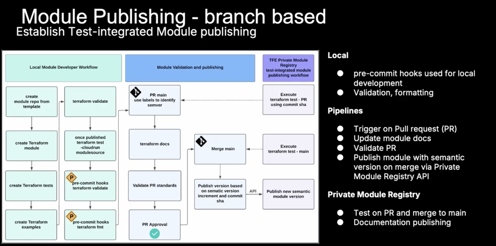
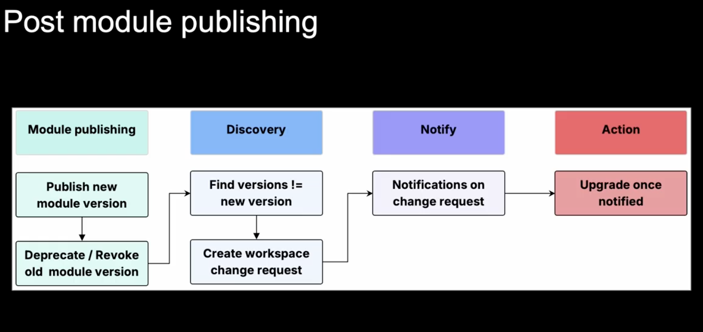
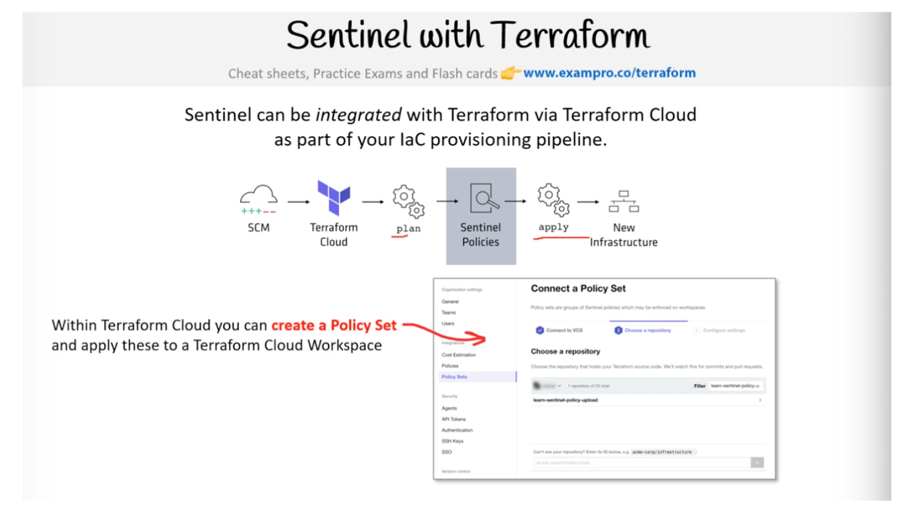

# IBM Hashicorp Terraform Associate Cloud Engineer (004) Certification

## 8. HCP Terraform

### 8a. Use HCP Terraform to create infrastructure

#### HCP Terraform Overview

HCP Terraform (formerly Terraform Cloud) is a managed service that provides a consistent, remote environment for team-based infrastructure-as-code (IaC) workflows. It moves the "source of truth" and execution from individual local machines to a centralized platform.

##### The Core Workflow

HCP Terraform is built to support three primary ways of working:

* **VCS-driven workflow (Primary)**:
  * Connects directly to version control (GitHub, GitLab, Bitbucket).
  * Changes to a branch automatically trigger a speculative "Plan," and merging triggers an "Apply."
* **CLI-driven workflow**:
  * Users run commands like terraform plan or apply from their local terminal, but the execution and state storage happen remotely in HCP Terraform.
* **API-driven workflow**:
  * Allows for integration into custom CI/CD pipelines or external automation tools.

##### State & Variable Management

* **Remote State Storage**:
  * Automatically handles state locking and versioning, eliminating the need for teams to manually configure S3 buckets or database locks.

* **Secure Variable Sets**:
  * Credentials and configuration variables are stored centrally. Sensitive values (like cloud API keys) are write-only and encrypted, so they never appear in logs or code.

##### Organizational Structure

* **Workspaces**:
  * The fundamental unit of HCP Terraform.
  * Each workspace represents a single configuration (root module) and its associated state.

* **Projects**:
  * A layer of organization above workspaces that allows teams to group related infrastructure (e.g., by application or department) and manage permissions at scale.

* **Stacks (New)**:
  * Designed for managing complex, interdependent infrastructure across multiple regions or accounts as a single unit.

##### Governance and Security

* **Policy as Code (Sentinel & OPA)**:
  * Allows organizations to define "guardrails."
  * For example, you can automatically block any plan that tries to deploy expensive instances or unencrypted databases.

* **Run Tasks**:
  * Integrates third-party security and compliance tools (like Snyk or Bridgecrew) directly into the Terraform plan/apply pipeline.

* **Private Module Registry**:
  * A private directory where teams can share versioned, pre-approved Terraform modules to ensure standardized infrastructure across the company.

##### Advanced Features (Paid Tiers)

* **Drift Detection**:
  * Automatically checks if the real-world infrastructure still matches the code and alerts operators if someone made manual changes ("ClickOps").

* **Continuous Validation**:
  * Periodically checks custom assertions within the code to ensure infrastructure is not just present, but healthy and functioning as expected.

* **Cost Estimation**:
  * Provides an estimate of how much the planned changes will increase or decrease your monthly cloud bill before you hit "Apply."

##### Deployment Options

* **HCP Terraform (SaaS)**:
  * The standard multi-tenant managed service hosted by HashiCorp.
* **Terraform Enterprise**:
  * A self-hosted, private instance of the platform for organizations with strict data residency or air-gapped requirements.

#### Pricing Options

* **The "Enhanced" Free Tier**:
  * The "Legacy Free" plan (which was user-based) officially reaches End-of-Life on March 31, 2026. All users are being transitioned to the Enhanced Free Tier:
  * Cost: $0
  * Limit: Up to 500 managed resources.
  * Users: Unlimited.
  * Included Features: SSO, Policy as Code (Sentinel/OPA), Run Tasks, and self-hosted agents.
  * Constraint: Only 1 concurrent run (one plan/apply at a time).
* Paid Tiers:
  * Once you exceed 500 resources, you move into paid tiers. Prices are typically billed hourly based on the peak number of resources managed during that hour.
  * PayGo (Pay-as-You-Go):
    * Essentials
      * Est. Monthly Cost: $0.10
      * Hourly Cost: $0.00013
      * Small teams needing more than 500 resources but basic features.
    * Standard
      * Est. Monthly Cost:$0.47
      * Hourly Rate: $0.00064
      * Teams needing Drift Detection, Audit Logs, and higher concurrency (up to 10).
    * Premium
      * Est. Monthly Cost: $0.99
      * Hourly Rate: $0.00135
      * Enterprises needing Terraform Stacks, advanced security, and high concurrency (up to 200).
    * Note: $500 in HCP credits is often provided to new accounts to offset initial costs during a trial phase.

#### Workspaces

A workspace is the foundational unit used to manage a collection of infrastructure. While local Terraform uses directories to organize resources, HCP Terraform uses workspaces to centralize configuration, state, and variables.

Workspaces can be created via the Web UI, the Terraform Provider (tfe provider), the API, or the CLI. They can be triggered by VCS events (like a pull request), via a manual "Queue Plan" in the UI, or through the CLI integration (terraform plan locally triggers a run in the cloud).

##### Workspace Contents

A workspace acts as a container for everything Terraform needs to manage a specific set of infrastructure:

* **Configuration**: Usually linked to a VCS repository (like GitHub) or uploaded via CLI/API.

* **State**: Stored securely within the workspace, including a full history of previous state versions for recovery and auditing.

* **Variables**: Environment and Terraform variables are managed in the UI, including "sensitive" variables for secrets (passwords/keys) that are hidden after entry.

* **Terraform Version Locking**: Workspaces and be configured to only use a specific version of terraform
* **Run History**:
  * A complete record of every plan and apply operation, including logs and user comments.
  * If you need to determine if a run is remote or local use the the [HCP Environment Variables](https://developer.hashicorp.com/terraform/cloud-docs/run/run-environment#environment-variables) as shown below

```hcl
output "current_workspace_name" {
  value = terraform.workspace
}

variable "HCP_TERRAFORM_RUN_ID" {
  type    = string
  default = ""
}

output "remote_execution_determine" {
  value = "Remote run environment? %{if var.HCP_TERRAFORM_RUN_ID != ""}Yes%{else}No this is local%{endif}!"
}
```

##### HCP Terraform vs Terraform CLI Workspaces

It is important to distinguish between the two:

* **HCP Terraform Workspaces**:
  * Persistent, shared environments used for collaboration and RBAC (Role-Based Access Control).
  * They are required to use the platform.
  * HCP Terraform workspaces are much more robust and are designed for team environments.
  * Configured in the `cloud` backend configuration
    * `organization`
      * Specifies the name of an HCP Terraform Organization to connect to
    * `workspaces.tags`
      * Specifies either a map of tag strings or a list of key-only string tags (legacy style)
      * Terraform links the working directory to existing workspaces in the org that match those tags. If none exist matching those tags, CLI prompts you to create a new workspace and applies those tags
    * `workspaces.name`
      * Name of the workspace, example `networking-prod`
      * Cannot be used in conjunction with `tags` configuration
    * `workspaces.project`
      * The name of an existing project within the workspace that matches the `name` and `tags`

```hcl

terraform {
  required_providers { ... }
  cloud {
      organization = "DavidTessierDemoOrg"

      workspaces {
        project = "networking-prod"
        tags = {
          layer = "networking"
          source = "cli"
        }
      }
   }
}

```

* **CLI Workspaces**:
  * Temporary partitions of state within a single local directory (`terraform.tfstate.d`)
  * An `environment` file is also create and identifies the current workspace in use
  * There is always a `default` workspace
  * Available commands:
    * `terraform workspace list`
      * Lists all local workspaces available
    * `terraform workspace new`
      * Creates a new workspace and switches to that workspace
      * use the `-state=old.terraform.tfstate` flag to create a new workspace from pre-existing state
    * `terraform workspace delete {workspace}`
      * Deletes the specified workspace, DESTRUCTIVE COMMAND!!
    * `terraform workspace select {workspace}`
      * Changes the current workspaces to the specified one

Sample directory structure:

```text
├── main.tf
├── moves.tf
├── outputs.tf
├── outputs.txt
├── terraform.tfstate
├── terraform.tfstate.backup
├── terraform.tfstate.d
│   └── demo
├── terraform.tfvars
└── variables.tf
```

##### Execution (Runs)

By default, workspaces use remote execution.
When a run is triggered:

* HCP Terraform provisions a disposable virtual machine.
* It pulls the configuration and variables.
* It executes the plan/apply using the stored state.

This ensures a consistent execution environment regardless of who triggers the run.

##### Organization and Best Practices

* **Decomposition**:
  * Rather than one massive "monolithic" workspace, HashiCorp recommends breaking infrastructure into smaller, logical workspaces (e.g., networking-prod, app-prod, database-prod).
* **Projects**:
  * Workspaces can be grouped into Projects to simplify organization and manage permissions at scale across different business units or teams.
* **Health Assessments**:
  * (Available in higher tiers)
  * Workspaces can automatically perform Drift Detection (checking if manual changes were made outside of Terraform) and Continuous Validation (checking if custom logic/assertions still pass).

**Links**:

* Workspaces → https://developer.hashicorp.com/terraform/cloud-docs/workspaces

#### Stacks

Another option for organizing you infrastructure is a new concept called `Stacks`.

While _Workspaces_ operates on a single configure and one state file, _Stacks_ allows you to manage multiple modules and environments as a single unified unit.

Stacks let you split your Terraform configuration into components and then deploy and manage those components across multiple environments. You can manage the lifecycle of each deployment separately, roll out configuration changes across your deployments, and manage your Stack as a unit in HCP Terraform.

##### Core Concepts of a Stack

A Stack moves away from the traditional .tf root module and introduces new file extensions:

* **Components**:
  * `.tfcomponent.hcl`
  * These are the "building blocks" of your infrastructure.
  * Each component typically points to an existing Terraform module (e.g., a VPC module and a Kubernetes module).

* **Deployments**
  * `.tfdeploy.hcl`
  * This is where you define where the components go.
  * You can define multiple deployments (e.g., dev, staging, prod or us-east-1, eu-west-1) within the same Stack.

* **Orchestration**:
  * Stacks automatically understand the dependencies between components.
  * If your App component needs an ID from your Network component, the Stack will handle the ordering and wait for the first to finish before starting the second.

Sample `.tfcomponent.hcl`

```hcl
# network.tfcomponent.hcl
component "vpc" {
  source = "terraform-aws-modules/vpc/aws"
  inputs = {
    cidr = "10.0.0.0/16"
    azs  = ["us-east-1a", "us-east-1b"]
  }
}

component "app" {
  source = "./modules/app"
  inputs = {
    # Stacks automatically handles this dependency
    vpc_id = component.vpc.vpc_id 
  }
}
```

Sample `.tfdeploy.hcl`

```hcl
# main.tfdeploy.hcl
deployment "staging" {
  inputs = {
    region       = "us-east-1"
    cluster_size = 2
    tags         = { Environment = "staging" }
  }
}

deployment "production" {
  inputs = {
    region       = "us-west-2"
    cluster_size = 10
    tags         = { Environment = "production" }
  }
}
```

##### Key Features

* **Deferred Changes**
  * If a value (like a Cluster ID) isn't known until after an "Apply," Stacks can partially plan and then automatically finish the rest once the value is available.
* **Linked Stacks**
  * You can share outputs between different Stacks. If a "Networking Stack" updates, it can automatically trigger a run in a downstream "App Stack."
* **DRY (Don't Repeat Yourself)**:
  * You define your infrastructure logic once in components and simply "instantiate" it multiple times in the deployment file.
* **Unified CLI**
  * Unlike the beta which used a separate tool, Stacks is now integrated into the main binary via the terraform stacks command.
* **Deployment Groups**
  * Allows you to group environments to control rollout logic, such as "deploy to all staging regions first, then wait for approval for production."

##### Stacks vs. Workspaces

Workspaces are best for isolated, self-contained pieces of infrastructure.

Stacks are best for interconnected infrastructure that needs to be repeated across many regions or accounts with synchronized updates.

##### Stacks CLI

The Stacks CLI is a new command-line interface for managing Stacks. It provides a unified interface for working with Stacks and is available in the main Terraform binary.  

```bash
terraform stacks create -organization-name <ORGANIZATION_NAME> -project-name <PROJECT_NAME> -stack-name <STACK_NAME>
```

##### Stacks Constraints and limitations

_Stacks_ have the following constraints:

* Each Stack currently supports a maximum of 20 deployments, which may limit scalability for large environments.
* Stack deployment groups currently support only one deployment per group.
* Each Stack supports up to 100 components.
* Each Stack supports up to 10,000 resources.
* Stacks can link to up to 20 other upstream Stacks. [Learn more about passing data between Stacks](https://developer.hashicorp.com/terraform/language/stacks/deploy/pass-data).
* Stacks can expose values to up to 25 downstream Stacks. [Learn more about passing data between Stacks](https://developer.hashicorp.com/terraform/language/stacks/deploy/pass-data).
* Stacks are not available for users on legacy HCP Terraform team plans. [Learn more about migrating to a current HCP Terraform plan](https://developer.hashicorp.com/terraform/cloud-docs/workspaces).

#### Remote Operations

* Terraform runs managed by HCP Terraform
* Can be initiated via webhooks from you VCS provider, UI console within the platform, API Calls, or by Terraform CLI
* Using the Terraform CLI the progress is streamed to the user's terminal to mimic local operations
* Remote Operations include features like Sentinel policy enforcement, cost estimation, and notifications
* Can be disabled for any workspace by changing its _Execution Mode_ to local, this make its only a remote backend to store state only and all execution is on the users workstations or continous integration workers (CI)

##### HCP Terraform Agents

* lightweight service deployed withing a specific network which allows HCP Terraform to communicated with isolated, private, or on-premise infrastructure
* Paid Feature
* Polls HCP Terraform or TF Enterprise for any changes to your configuration and executes the changes locally
* Don't need to allow public ingress traffic to resources
* Supports ability for running custom programs, called _hooks_, during specific terraform runs
  * Example: A _hook_ can dynamically download software required by the terraform run or send and HTTP request to a system to kick off an external workflow.

**Agent Links**:

* Tutorial Walkthrough → https://developer.hashicorp.com/terraform/tutorials/cloud/cloud-agents

### 8b. Describe HCP Terraform collaboration and governance features

#### Explorer

_Explorer_ is a centralized dashboard designed to give platform administrators and organization owners a "bird's-eye view" of their entire infrastructure estate.

##### Core Purpose

As organizations scale to hundreds or thousands of workspaces, it becomes difficult to track compliance and health. Explorer acts as a system of record, allowing you to query data across all workspaces in an organization to identify technical debt, security risks, and operational health.

##### Explorer - Key Features

* **Consolidated Visibility**: View and filter data across all workspaces, modules, and providers from a single interface.

* **Pre-built "Use Case" Queries:** Quickly identify common issues using built-in reports:

* **Terraform Versions**: Find workspaces running outdated or deprecated versions of Terraform.

* **Drift Detection**: Identify workspaces where the real-world infrastructure has "drifted" from the code.

* **Module & Provider Usage**: Track which versions of modules and providers are being used and where they need to be patched.

* **VCS Source**: See which repositories are driving which infrastructure.

* **Custom Query Builder**: Create complex filters (e.g., "Show me all production workspaces in the 'Finance' project that are using AWS provider version < 4.0").

* **Data Export**: Export results to CSV for external auditing, reporting, or manual review.

* **Performance Optimized**: (Specifically for Terraform Enterprise) It uses a secondary "read-only" database so that complex reporting queries do not slow down your actual infrastructure runs.

##### Permissions & Access

To access Explorer, a user must generally be an Organization Owner or belong to a team with "Read all workspaces" or "Read all projects" permissions.

It is available in the top-level side navigation of the HCP Terraform UI under the "Explorer" tab.

#### Private Registries

* Works similarly to the public Terraform Registry
* Helps searching for Terraform providers and Modules across you organization
* Includes support for versioning and a searchable list of available providers and modules
* Referencing modules published to the private repos use a registry source address of the following form `app.terraform.io/<ORGANIZATION-NAME>/terraform/<NAME>/<PROVIDER>`
  * Example `source  = "app.terraform.io/hashicorp-learn/s3-webapp/aws"`
* Module Versioning
  * Recommended is Semantic Versioning (e.g. v1.0.0)
    * 1 → Major, 0 → Minor, 0 → Patch Version
    * Major: New Behavior/Breaking Change
    * Minor: New Feature (Possible Breaking Change), mostly backwards compatible
    * Patch: Fix/Update, Backwards Compatible



**Private Registry Links**:

* Using private registries tutorial → https://developer.hashicorp.com/terraform/tutorials/modules/module-private-registry-share
* Publishing Private (custom) providers → https://developer.hashicorp.com/terraform/cloud-docs/registry/publish-providers

##### No-Code Modules & Provisioning

* Feature available in the Standard Tier and up
* Allows users to deploy infrastructure resources without writing any Terraform configuration
* Self-service model that gives developers with limited infrastructure knowledge a way to deploy resources they need
* Tutorial → https://developer.hashicorp.com/terraform/tutorials/cloud/no-code-provisioning

#### Change Requests

* Available in Standard and up
* Create backlog of action items recorded on a workspace
* Enable admins to notify teams directly if a workspace requires action
* Workspace action items (e.g.)
  * Updating deprecated or revoked module versions
  * Getting security updates
  * Fixing bugs
  * Compliance fixes



#### Policy Enforcement

Policies are rules that HCP Terraform enforces on Terraform runs. You can define policies using either the [Sentinel](https://developer.hashicorp.com/terraform/cloud-docs/policy-enforcement/define-policies/custom-sentinel) or [Open Policy Agent (OPA)](https://developer.hashicorp.com/terraform/cloud-docs/policy-enforcement/opa) policy-as-code frameworks.

Policy Sets are used by HCP Terraform to enforce "Policy as Code" guardrails across your infrastructure. These rules are checked after a Terraform plan but before the apply phase.

A Policy Set is a group of individual policies (written in Sentinel or OPA/Rego) that can be applied globally to an entire organization, specific projects, or individual workspaces.

Note: HCP Terraform Cloud Free Edition includes one policy set of up to five policies. In Paid Tiers, you can connect a policy set to a version control repository or create policy set versions via the API. Refer to [HCP Terraform Cloud pricing](https://www.hashicorp.com/products/terraform/pricing) for details.

You can use two policy-as-code frameworks to define fine-grained, logic-based policies: Sentinel and Open Policy Agent (OPA). Depending on the settings, policies can act as advisory warnings or firm requirements that prevent Terraform from provisioning infrastructure:
* Sentinel
* Open Policy Agent (OPA)

**Enforcement Levels**:

* **Advisory**: Does not stop the run; only provides a warning in the UI.
* **Soft Mandatory**: Stops the run, but a user with "Manage Policy Overrides" permissions can manually proceed.
**Hard Mandatory**: Stops the run completely. It cannot be bypassed unless the policy set itself is specifically configured to allow overrides.

**Publishing Methods**:

**VCS-connected (Recommended)**: Policies are stored in a GitHub/GitLab repo. HCP Terraform automatically updates whenever you push code.

**Individually Managed (UI)**: You manually paste code into the HCP Terraform settings. Best for small-scale testing.

**API/Provider Driven**: Using the tfe provider to automate the creation of policy sets via code.

**Scope**: You can narrow a policy set so it only affects workspaces with specific tags or within specific projects, preventing "policy bloat" where unrelated rules affect every workspace.

#### Sentinel

Sentinel is the Policy-as-Code product from HashiCorp that automatically enforces logic-based policy decisions across all HashiCorp Enterprise products.

Sentinel allows users to implement policy-as-code using the [Sentinel policy language](https://docs.hashicorp.com/sentinel/concepts/language) in a similar way to how Terraform implements infrastructure-as-code. You use imports to parse the Terraform plan, state, and configuration. For details on how to Define Sentinel Policies check the [documentation](https://developer.hashicorp.com/terraform/cloud-docs/workspaces/policy-enforcement/define-policies/custom-sentinel).

Sentinel Example (Restricting Instance Types):

This policy ensures that developers only use small, cost-effective AWS instances:

```hcl
import "tfplan/v2" as tfplan

# Filter for all aws_instance resources
all_instances = filter tfplan.resource_changes as _, rc {
    rc.type is "aws_instance" and
    (rc.mode is "managed")
}

# Rule: Instance type must be t2.micro or t2.small
main = rule {
    all all_instances as _, instance {
        instance.change.after.instance_type in ["t2.micro", "t2.small"]
    }
}
```

Sample Sentinel Policy that check for appropriate tags on all s3 buckets:

```hcl
import "tfplan/v2" as tfplan

s3_buckets = filter tfplan.resource_changes as _, rc {
    rc.type is "aws_s3_bucket" and
    (rc.change.actions contains "create" or rc.change.actions is ["update"])
}

bucket_tags = rule {
    all s3_buckets as _, instances {
        instances.change.after.tags is not null
    }
}

main = rule {
    bucket_tags
}
```

##### Open Policy Agent

Open Policy Agent or OPA is purpose built framework for reasoning about information represented in structured documents. The data that your service and its users publish can be inspected and transformed using OPA’s native query language Rego.

Rego, which was inspired by Datadog's well understood and decades old query language.
Rego extends Datadog to support structured document models such as JSON.

Rego is a declarative language that authors can create queries which are assertions on data store in OPA.  which can be used to define policies that enumerate instances of data that violate the expected state of the system.

The following shows sample OPA input data:

```json
{
"plan": {
 "format_version": "1.1",
 "output_changes": {
 },
 "planned_values": {
  },
  "resource_changes": [
 ],
 "terraform_version": "1.2.7"
},

"run": {
  "organization": {
  "name": "hashicorp"
  },
  "workspace": {
  }
}
}
```

Example OPA Policy in Rego Language ensures that databases are no larger than 128 GB:

```rego
package terraform.policies.public_ingress

import input.plan as plan

deny[msg] {
  r := plan.resource_changes[_]
  r.type == "aws_security_group"
  r.change.after.ingress[_].cidr_blocks[_] == "0.0.0.0/0"
  msg := sprintf("%v has 0.0.0.0/0 as allowed ingress", [r.address])
}
```

The following OPA query for this policy is `data.terraform.policies.fws.database.fws_db_001.rule`

```rego
package terraform.policies.fws.database.fws_db_001

import future.keywords.in
import input.plan as tfplan

actions := [
    ["no-op"],
    ["create"],
    ["update"],
]

db_size := 128

resources := [resource_changes |
    resource_changes := tfplan.resource_changes[_]
    resource_changes.type == "fakewebservices_database"
    resource_changes.mode == "managed"
    resource_changes.change.actions in actions
]

violations := [resource |
    resource := resources[_]
    not resource.change.after.size == db_size
]

violators[address] {
    address := violations[_].address
}

rule[msg] {
    count(violations) != 0
  msg := sprintf(
    "%d %q severity resource violation(s) have been detected.",
        [count(violations), rego.metadata.rule().custom.severity]
    )
}
```

OPA (Rego) Example (Mandatory Tags):

This policy checks that every AWS VPC has a "Department" tag for billing purposes:

```rego
package terraform

import input.tfplan as tfplan

# Deny if a vpc is missing the Department tag
deny[msg] {
    resource := tfplan.resource_changes[_]
    resource.type == "aws_vpc"
    
    # Check if tags are missing or Department is not in tags
    not resource.change.after.tags.Department
    
    msg := sprintf("VPC %v is missing the mandatory 'Department' tag", [resource.address])
}
```

Apply the policy via Terraform (`tfe` provider):

You can manage the policy set itself as code:

```hcl
resource "tfe_policy_set" "global_security" {
  name          = "global-security-rules"
  description   = "Policies for security compliance"
  organization  = "my-org"
  kind          = "sentinel" # or "opa"
  
  # Link to a VCS repo containing your policies
  vcs_repo {
    identifier         = "my-org/terraform-policies"
    branch            = "main"
    oauth_token_id    = "ot-xxxxxx"
  }

  # Apply to all workspaces
  global = true
}
```

##### Sentinel and HCP Terraform Cloud



##### Sentinel cli

* `sentinel apply`: execute a policy locally for development purposes. `0` is pass, `1` is fail,`2` is undefined(fail, but because the result was undefined), and `3` is a runtime error. Errors unrelated to the policy status itself are returned with an exit code of `9`.
* `sentinel fmt`: formats a policy source to a canonical format.
* `sentinel test`: runs policies against the _Sentinel_ test framework. 

**Policy Links**:

* Terraform Cloud → https://developer.hashicorp.com/terraform/cloud-docs
* The UI- and VCS-driven Run Workflow → https://developer.hashicorp.com/terraform/cloud-docs/workspaces/run/ui
* Compare Packages → https://www.hashicorp.com/en/pricing?tab=terraform
* Enforce a policy with Sentinel → https://developer.hashicorp.com/terraform/tutorials/policy/policy-quickstart

#### Projects

HCP Terraform Projects are an organizational layer used to group related workspaces and Stacks, providing a way to manage access and settings at scale.

##### Core Functionality

* **Access Control**:
  * Projects act as the primary boundary for Role-Based Access Control (RBAC). Instead of assigning permissions to dozens of individual workspaces, you can grant a team access to a single Project, and they automatically inherit permissions for every workspace inside it.

* **Organization**:
  * They allow you to categorize infrastructure by business unit, department, environment (e.g., "Production" vs. "Development"), or technical team.

* **Mandatory Placement**:
  * Every workspace and Stack must belong to exactly one project.

* **Default Project**:
  * Every organization starts with a "Default Project."
  * If you don't specify a project when creating a workspace, it is placed here.
  * Can be renamed but **cannot be deleted**.

##### Key Settings & Features

* **Execution Mode Overrides**:
  * You can set a default execution mode (Remote, Local, or Agent) at the project level. Any new workspace created within that project will inherit this setting, overriding the broader organization default.

* **Granular Permissions**:
  * Managing project-level permissions (e.g., "Manage Projects & Workspaces") typically requires a paid tier (Essentials, Standard, or Premium).

* **Workspaces & Stacks**:
  * Projects are the "container" for both traditional Workspaces and the newer Terraform Stacks.

##### Execution Modes

_Execution Modes_ define where the actual Terraform "compute" happens (the `plan` and `apply` operations).

Setting the execution mode at the Project level is a powerful way to set a "default" for all workspaces within that project, ensuring consistency across a team or department.

Four Execution Modes:

* **Organization Default**:
  * Inherits from Org
  * Use this if you want the project to simply follow the broader company settings.
* **Remote**:
  * HCP Terraform's Cloud
  * The Standard.
  * Best for public cloud (AWS/Azure/GCP).
  * Provides a managed, consistent environment with full audit logs and UI visibility.
* **Agent**
  * Your Own Infrastructure
  * Private/Secure.
  * Best for on-premises data centers or "air-gapped" cloud environments where the Terraform runner needs direct network access to private APIs.
* **Local**
  * Your Workstation
  * State-Only.
  * Terraform runs on your laptop, but the state is stored and locked in the cloud.
  * Useful for local debugging or sensitive dev work where you don't want to send code to the cloud.

How Inheritance Works:

* **Organization Level**: Sets a global default (usually Remote).
* **Project Level**: Overrides the Org default for all its workspaces.
* **Workspace Level**: Can further override the Project default if a specific workspace needs a "one-off" configuration (e.g., a single workspace using an Agent while the rest of the project is Remote).

Key Considerations:

* **Credential Storage**:
  * In Remote mode, credentials must be stored in HCP Terraform (Variables or Dynamic Credentials).
  * In Agent mode, credentials can stay on the agent host.
  * In Local mode, it uses your local CLI environment (e.g., ~/.aws/credentials).
* **Feature Availability**:
  * Features like Cost Estimation and Policy Enforcement (Sentinel/OPA) typically require Remote or Agent modes to function fully within the HCP UI.
* **Stacks Support**:
  * Note that the new Terraform Stacks feature does not support Local execution; it requires Remote or Agent modes to manage its multi-deployment orchestration.

##### Best Practices for Structure

HashiCorp recommends defining projects based on administrative boundaries. 
For example:

* **By Team**: frontend-team, data-science-team, security-ops.
* **By Application**: billing-platform, customer-portal.
* **By Compliance**: pci-compliant-zone, public-facing-web.

Sample using `tfe` provider:

```hcl
# 1. Create the Project with a default execution mode
resource "tfe_project" "prod_project" {
  organization = "my-org"
  name         = "Production-Apps"
  
  # New workspaces in this project will default to Agent mode
  # Note: In some provider versions, this is set via a separate settings resource
  default_execution_mode = "agent"
  default_agent_pool_id  = "apool-xxxxxxxxxxxx" 
}

# 2. Create a Workspace inside that Project
resource "tfe_workspace" "app_db" {
  name         = "inventory-db-prod"
  organization = "my-org"
  project_id   = tfe_project.prod_project.id
}

# 3. Apply specific settings (Optional Override)
resource "tfe_workspace_settings" "app_db_settings" {
  workspace_id = tfe_workspace.app_db.id
  
  # If we leave 'execution_mode' blank, it INHERITS 'agent' from the Project
  # If we want to override it to 'remote' for just this one:
  # execution_mode = "remote" 
}
```

When using the TFE provider, keep these inheritance rules in mind:

* **Omitting `execution_mode`**:
  * If you omit the execution_mode in tfe_workspace_settings, Terraform will unset any explicit workspace-level setting, causing it to fall back to the Project default.

* **The "Organization Default" Value**:
  * If the Project is set to `organization_default`, the workspace effectively looks two levels up to the global Org settings.

* **Deprecation Warning**:
  * You might see old tutorials using `execution_mode` directly inside the `tfe_workspace` resource. This is now deprecated. Always use the `tfe_workspace_settings` resource for managing these behaviors to ensure you don't accidentally revert settings during a provider update.

`tfe` Provider Resources:

* `tfe_project`: Creates the container and sets the default_execution_mode.
* `tfe_workspace` (**Deprecated**): Creates the workspace and links it to a project_id.
* `tfe_workspace_settings`: The modern way to set execution_mode or agent_pool_id for a specific workspace.

#### Health

Health Assessments is a feature in HCP Terraform that allows you to automatically monitor whether your real-world infrastructure remains in sync with your configuration and whether it meets specific custom business rules.

Health assessments consist of two primary functions that run periodically (on a schedule) without interrupting your active runs:

* **Drift Detection**:
  * Identifies if changes were made to your infrastructure outside of Terraform (e.g., someone manually changed a firewall rule in the AWS Console), deviation known as _configuration drift_. If drift is found, Terraform proposes the necessary changes to fix it.
  * _Configuration drift_ happens when external changes affecting remote objects invalidate your infrastructure configuration.
  * Different then _state drift_, which occurs when external changes affecting remote objects do not invalidate your infrastructure configuration.
    * Can be remediated using `--refresh-only` mode using `terraform plan` or `terraform apply`
  * Does not detect _state drift_

* **Continuous Validation**:
  * Uses `check` blocks to verify that custom assertions remain true after the infrastructure is provisioned (e.g., checking if a website is still reachable or if a certificate is about to expire).
  * Also Evaluates `preconditions` and `postconditions` as part of an assessment
  * Validation Failures:
    * These appear in the "Health" tab of the workspace.
    * Because they are "checks" and not "postconditions," they do not stop your plan from applying; they act as an alerting mechanism to inform you that the infrastructure is not behaving as expected.

Key Requirements:

* **Version**: Terraform 0.15.4+ (Drift) or 1.3.0+ (Continuous Validation).

* **Tier**: Available in HCP Terraform Standard and Premium editions.

* **Execution**: Must be in Remote or Agent execution mode with at least one successful previous apply.

##### Health Assessment Scheduling

Once enabled for a workspace, HCP Terraform runs the first health assessment based on whether there are active Terraform runs for the workspace:

* **No active runs**: A few minutes after you enable the feature.
* **Active speculative plan**: A few minutes after that plan is complete.
* **Other active runs**: During the next assessment period.

A health assessment never interrupts or interferes with runs.

HCP Terraform pauses health assessments if the latest run ended in an errored state.

If you are an administrator for a workspace and it satisfies all assessment requirements, you can trigger a new assessment by clicking Start health assessment on the workspace's Health page.

Assessments run concurrently and do not affect your concurrency limits, HCP Terraform also monitors and controls health assessment concurrency to avoid issues for large-scale deployments with thousands of workspaces

#### HCP Teams

Teams are groups of users within an organization used to manage permissions at scale. Instead of assigning permissions to individuals, you assign them to a team and then manage the team's membership.

* **Organization Context**: Users must belong to at least one team to be considered a member of an organization.

* **The "Owners" Team**:
  * Every organization has an immutable "Owners" team with full administrative rights.
  * It cannot be deleted, and it must always have at least one member.
  * Every organization has a team named **owners** and members of this team are sometimes called organization owners
  * Creator of the organization is the first member of the _owners_ team and can add and remove other members in the same ways as other teams
  * In free organizations, the owners team is limited to five members. In paid organizations, the size of the owners team is not limited.
  * Only organization owners can perform the following tasks:
    * Creating and deleting teams
    * Managing organization-level permissions granted to teams
    * Viewing the full list of teams, both visible and secret
    * Managing organization settings


* **Team Tokens**:
  * Each team can have its own API token.
  * This is useful for CI/CD pipelines or automation scripts that should perform actions on behalf of a specific group (e.g., "Network-Admins") rather than a specific person.

* **Permissions**: Teams are the primary vehicle for granting access to Workspaces, Projects, and Stacks.

* **Availability**: Team management is available on HCP Terraform Essentials, Standard, and Premium tiers.

Management of Teams and team members can be done via the Console, API or TFE Provider:

APIs

* [**Teams API**](https://developer.hashicorp.com/terraform/cloud-docs/api-docs/teams):
  * Used to list, create, update, and delete teams
  * TFE Provider resource: `tfe_team`
* [**Team Members API**](https://developer.hashicorp.com/terraform/cloud-docs/api-docs/team-members)
  * Used to add and delete users from teams
  * TFE Provider resource: `tfe_team _embers`
* [**Team Tokens API**](https://developer.hashicorp.com/terraform/cloud-docs/api-docs/team-tokens):
  * Used to generate and delete tokens and list an organization's team tokens
  * * TFE Provider resource: `tfe_team_token`
* [**Team Access API**](https://developer.hashicorp.com/terraform/cloud-docs/api-docs/team-access):
  * Used to manage team access to one or more workspaces
  * * TFE Provider resource: `tfe_team_access`

##### TFE Provider Usage Examples

The most efficient way to manage teams is through "Terraform-managing-Terraform" using the `tfe` (**Terraform Enterprise**) provider.

**Creating a Team and Adding Members**:

This example creates a "Developers" team and assigns specific users to it by their email addresses.

```hcl
resource "tfe_team" "developers" {
  name         = "app-dev-team"
  organization = "my-org-name"
}

resource "tfe_team_members" "dev_members" {
  team_id = tfe_team.developers.id
  usernames = [
    "user1@example.com",
    "user2@example.com"
  ]
}
```

**Assigning Team Access to a Workspace**:

Once a team is created, you must grant it access to a workspace. This example gives the "Developers" team "write" access (permission to plan and apply) to a specific workspace.

```hcl
resource "tfe_team_access" "dev_workspace_access" {
  access       = "write" # Options: read, plan, write, or admin
  team_id      = tfe_team.developers.id
  workspace_id = "ws-XXXXXXXXXXXXXX" 
}
```

**Creating a Team API Token**:

Useful for automation where you want a "service account" style token linked to a functional group.

```hcl
resource "tfe_team_token" "dev_token" {
  team_id = tfe_team.developers.id
}

# You can then use this token in a CI/CD pipeline
output "team_api_token" {
  value     = tfe_team_token.dev_token.token
  sensitive = true
}
```

## 8c. Describe how to organize and use HCP Workspaces and projects

Also review [8b. Projects Overview](#projects)

Can use the TFE provider resource `tfe_project` to manage projects

```hcl
resource "tfe_project" "test" {
  organization = tfe_organization.test-organization.name
  name         = "projectname"
  tags         = {
    cost_center = "infrastructure"
    team        = "platform"
  }
}

resource "tfe_project_policy_set" "test" {
  policy_set_id = tfe_policy_set.test.id
  project_id    = tfe_project.test.id
}
```

### Run Triggers

Run triggers allow you to connect workspaces so that a successful apply in one workspace (the source) automatically queues a run in another workspace (the destination).

Key Characteristics:

* **Automation**: They eliminate the need for manual intervention or custom CI/CD scripts to chain infrastructure deployments.
* **Dependency Management**: They are designed for "downstream" workspaces that depend on the infrastructure or outputs (Remote State) of an "upstream" workspace.
* **Safety**: A trigger only fires if the source workspace run is successfully applied. If the source run fails or is canceled, the downstream run is not queued.
* **Limits**: A single workspace can be connected to up to 20 source workspaces.

The most frequent pattern is a layered infrastructure pipeline:

* **Network Workspace**: Deploys VPCs and subnets.
* **Database Workspace**: (Triggered by Network) Deploys an RDS instance into those subnets.
* **App Workspace**: (Triggered by Database) Deploys the application once the DB endpoint is ready.

If you want to set this up via the Terraform Cloud dashboard:

* Go to the destination workspace (e.g., app-production).
* Navigate to Settings > Run Triggers.
* Under Source Workspaces, search for and select the source workspace (e.g., networking-production).
* Click Add workspace.

Set this up using the TFE terraform provider:

```hcl
# 1. Define the Source Workspace (e.g., Networking)
resource "tfe_workspace" "networking" {
  name         = "prod-networking"
  organization = "my-org"
}

# 2. Define the Destination Workspace (e.g., Web Application)
resource "tfe_workspace" "webapp" {
  name         = "prod-webapp"
  organization = "my-org"
}

# 3. Create the Run Trigger
# This tells TFC: "When 'networking' applies successfully, run 'webapp'"
resource "tfe_run_trigger" "webapp_trigger" {
  workspace_id  = tfe_workspace.webapp.id
  sourceable_id = tfe_workspace.networking.id
}
```

Best Practices & Tips:

* **Auto-Apply**:
  * By default, triggered runs queue a Plan but wait for manual approval to Apply. If you want a fully hands-off pipeline, you must enable "Auto-apply run triggers" in the destination workspace's Run Trigger settings.
* **Remote State Access**: For a triggered run to be useful, the destination workspace usually needs to read outputs from the source. Ensure you have granted Remote State Access between the two workspaces in their respective settings.
* **Avoid Circular Dependencies**: Be careful not to create a loop (Workspace A triggers B, and B triggers A), as this will cause an infinite loop of runs.

### Variable Sets

HCP Terraform Variable Sets are used to manage and reuse variables across multiple workspaces efficiently. Instead of defining the same credentials or configuration settings for every individual workspace, you define them once at the organization level and apply them to groups of workspaces.

Three Scopes of Application:

* **Global**: Applies to all current and future workspaces in the organization.
* **Project-specific**: Applies to all workspaces within a specific project.
* **Workspace-specific**: Manually selected workspaces.

If multiple variable sets assigned to a workspace contain the same variable name, HCP Terraform resolves the conflict using lexical (alphabetical) order of the variable set names. For example, a set named "Add Capacity" will override a set named "Default Settings" because "A" comes before "D".

You can still override any variable set value by defining a variable with the same name directly within a specific workspace's "Variables" tab.

Can use the TFE provider resource `tfe_variable_set` to create manage variables sets and assign variables to them:

```hcl
resource "tfe_variable_set" "test" {
  name          = "Test Varset"
  description   = "Some description."
  organization  = tfe_organization.test.name
}


resource "tfe_project_variable_set" "test" {
  project_id    = tfe_project.test.id
  variable_set_id = tfe_variable_set.test.id
}

resource "tfe_variable" "test-a" {
  key             = "seperate_variable"
  value           = "my_value_name"
  category        = "terraform"
  description     = "a useful description"
  variable_set_id = tfe_variable_set.test.id
}
```

## 8d. Configure and use HCP Terraform integration

### Use CLI with HCP Terraform

The CLI-driven workflow is one of three primary ways to interact with HCP Terraform (the others being VCS-driven and API-driven). In this mode, the CLI acts as the "remote controller" for the platform.

**Flow**:

* **Local Execution, Remote State**: You run commands like `terraform plan` on your machine.
* **Configuration Upload**: The CLI packages your code (excluding files in `.terraformignore`) and sends it to HCP Terraform.
* **Remote Operations**: The actual `plan/apply` executes on HashiCorp’s infrastructure (or your private agents).
* **Streaming Logs**: The output is streamed back to your terminal in real-time.

**Key Advantages**:

* **Infrastructure as Code (IaC) Parity**: It feels identical to using local Terraform but adds remote locking, history, and team visibility.

* **No VCS Required:** You can manage infrastructure without a GitHub/GitLab connection, making it ideal for private or experimental projects.

* **CLI Features**: You retain access to specific CLI commands like terraform console, terraform state, and terraform import that are harder to use in a pure VCS/GitOps flow.

#### CLI Usage Examples

Authentication is done using `terraform login [hostname]` and initialization through `terraform init` with a `cloud` block configured.

If you don't provide an explicit hostname, Terraform will assume you want to log in to HCP Terraform at `app.terraform.io`.

By default, Terraform will obtain an API token and save it in plain text in a local CLI configuration file called `credentials.tfrc.json`.

Location of the `credentials.tfrc.json`:

* Mac/Linux: `~/.terraform.d/credentials.tfrc.json`
* Windows: `%APPDATA%\terraform.d\credentials.tfrc.json`

Example:

```json
{
  "credentials": {
    "app.terraform.io": {
      "token": "xxxxxx.atlasv1.zzzzzzzzzzzzz"
    }
  }
}
```

If you have tokens in multiple places, Terraform chooses them in this order:

* `TF_TOKEN_app_terraform_io` (Environment Variable)
* `TFE_TOKEN` (Environment Variable - used specifically by the tfe provider)
* `credentials.tfrc.json` (Local file from terraform login)
`.terraformrc` (Legacy configuration file)

If you configure the `cloud` block to use a workspace that doesn't yet exist in your organization, HCP Terraform will create a new workspace with that name when you run `terraform init`. The output of terraform init will inform you when this happens.

However, these "auto-created" workspaces come with specific default behaviors:

* **Execution Mode**: Defaults to Remote. Your computer sends the code to HashiCorp’s servers to run the plan/apply.
* **Terraform Version**: It will always use the latest stable release of Terraform available at that moment.
* **Variables**: The workspace starts "empty." It won't have your API keys or environment variables unless you have Global Variable Sets configured or use .auto.tfvars files.
* **VCS Connection**: It is created as a CLI-driven workspace. It is not linked to GitHub/GitLab automatically; you must do that manually in the UI if desired.

If you specify a project name in your workspaces block that isn't there, Terraform creates it during initialization.

If you have the project name defined in your code and in the `TF_CLOUD_PROJECT` environment variable, the code (the project argument) always wins.

##### Best Practices For CLI

* Strict `.terraformignore`:
  * Always create a `.terraformignore` file.
  * The CLI uploads your directory to the cloud, you must prevent it from uploading massive .git folders or local provider binaries.

* Example: Add `**/.terraform/*, *.tfvars, and .git/.`
* Use Variable Sets:
  * Instead of passing local -var-file flags (which can lead to sensitive data leaks), define "Variable Sets" in the HCP Terraform UI. These variables are automatically injected into your CLI-driven runs.

* Local-to-Cloud Migration:
  * If you have an existing local state, use `terraform init -migrate-state`. 
  * Terraform will detect the cloud block and offer to upload your local state file to the new remote workspace.

Speculative Plans for PRs: If you are using a CI/CD pipeline, use terraform plan to generate "Speculative Plans" that show up in pull requests but don't accidentally trigger a real infrastructure change.

Enable Notifications: Since runs happen on a remote platform, configure Slack or Email notifications in the HCP Terraform Workspace settings so you know when a teammate (or a script) starts a run.


### Connecting to HCP Terraform - `cloud` block

The `cloud` block is the modern replacement for the legacy remote backend. It serves as the primary integration point between the Terraform CLI and HCP Terraform (formerly Terraform Cloud) or Terraform Enterprise.

The `cloud` block sits inside the top-level `terraform {}` configuration block. Its primary role is to tell Terraform to use a remote platform for state storage and run execution.

**Key Features**:

* **Remote Execution**: By default, terraform plan and apply commands are executed on HCP Terraform’s infrastructure, not your local machine.
**State Management**: Automatically handles state locking and versioning in a central, secure location.
**Workspace Tagging**: Unlike the old remote backend which relied on name prefixes, the cloud block can use tags to dynamically group and select workspaces.
* **Enhanced CLI Output**: Provides structured, readable output in your terminal while the remote run is in progress.

##### `cloud` Block Usage

Scenario A: Single Workspace (Standard)

Use this when your local directory maps directly to one specific workspace.

```hcl
Terraform
terraform {
  cloud {
    organization = "my-company"

    workspaces {
      name = "web-app-production"
    }
  }
}
```

Scenario B: Tag-Based Workspaces (Multi-Environment)

This allows one configuration to manage multiple environments (e.g., dev, prod) by filtering workspaces that share a specific tag.

```hcl
Terraform
terraform {
  cloud {
    organization = "my-company"

    workspaces {
      tags = ["networking", "aws"]
    }
  }
}
```

Scenario B: Tag-Based Workspaces (Multi-Environment)
This allows one configuration to manage multiple environments (e.g., dev, prod) by filtering workspaces that share a specific tag.

```hcl
Terclraform
terraform {
  cloud {
    organization = "my-company"

    workspaces {
      tags = ["networking", "aws"]
    }
  }
}
```

Note: After running terraform init, you use terraform workspace select <name> to switch between them.

Scenario C: Specifying a Custom Hostname
Used for Terraform Enterprise (on-premise) users.

```hcl
Terraform
terraform {
  cloud {
    hostname     = "tfe.example.com"
    organization = "my-org"

    workspaces {
      name = "my-app"
    }
  }
}
```

##### Best Practices

* Use `.terraformignore`:
  * Since the cloud block uploads your configuration to HCP Terraform for remote execution, always include a `.terraformignore` file. This prevents large or sensitive files (like `.git/`, `.env`, or local binaries) from being uploaded, speeding up the "uploading configuration" phase.

* Prefer Tags over Names for Reusability:
  * If you are building a module or configuration that applies to multiple environments, use the tags block. This makes your CLI workflow more flexible.

* Isolate Version Constraints:
  * Always include required_version and required_providers alongside your cloud block to ensure that the remote execution environment matches your local development environment.

* CI/CD Integration:
  * When using the cloud block in a CI/CD pipeline (like GitHub Actions), ensure you set the TF_TOKEN_app_terraform_io environment variable so the CLI can authenticate without interactive login.

* Migration Tip:
  * If you are moving from the old backend "remote" block, simply replace it with cloud. Terraform will detect the change during terraform init -migrate-state and preserve your existing state data.

**`cloud` Block Links**:

Using the Terraform Cloud Block → https://www.youtube.com/watch?v=zARP_Cu8dwQ


[Back to Exam Guide](README.md)