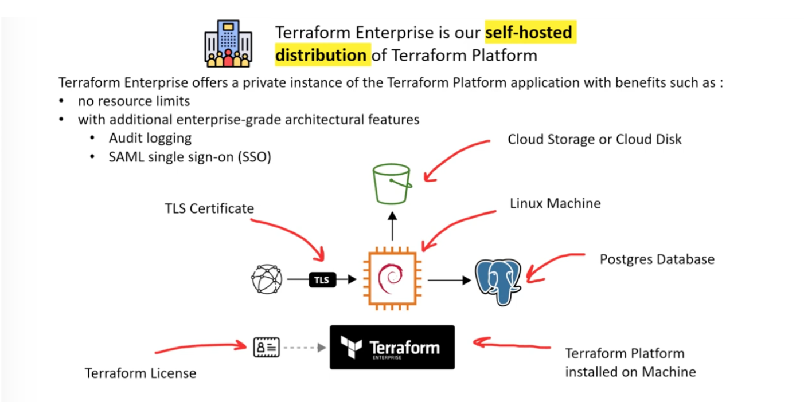

# Hashicorp Terraform Associate Cloud Engineer (003) Certification

# 9. Understand Terraform Cloud capabilities

## 9a. Explain how Terraform Cloud helps to manage infrastructure

#### Terraform Cloud
* _Terraform Cloud_ is a Software-as-a-Service (SaaS) offering that has a single **[unified web portal](https://app.terraform.io)** for:
  * Remote state storage
  * Version Control Integrations
  * Flexible workflows
  * Collaborate on infrastructure changes
* Paid editions allow you to add more than five users, create teams with different levels of permissions, and collaborate more effectively.
* Free-tier allows for team collaboration for the first 5 users of your organizations
* Use it for majority of scenarios
* likely not a good case for high regulatory requirements
* Terraform Cloud Plus Edition allows organizations to enable audit logging, continuous validation, and automated configuration drift detection.

##### Terraform Workflow
* Terraform cloud runs Terraform CLI to provision infrastructure
* Terraform cloud runs Terraform on disposable virtual machines in its own cloud infrastructure by default
  * You can leverage [Terraform Cloud Agents](https://developer.hashicorp.com/terraform/cloud-docs/agents) to run Terraform on your own isolated, private, or on-premises infrastructure. Remote Terraform execution is sometimes referred to as "remote operations."
* Remote execution helps provide consistency and visibility for critical provisioning operations. It also enables powerful features like Sentinel policy enforcement, cost estimation, notifications, version control integration, and more.

##### Terraform Cloud Infrastructure Organization
* Terraform Cloud organizes infrastructure into Project and workspaces instead of directories for local execution
* Each workspace contains everything necessary to manage a given collection of infrastructure, and Terraform uses that content when it runs in the context of that workspace.
  * Includes variables, state, credentials and secrets
    * Credentials and secrets are stored as sensitive data
* In addition each workspace contains
  * State versions
    * each workspace retains backups of its previous state files. Although only the current state is necessary for managing resources, the state history can be useful for tracking changes over time or recovering from problems.
  * Run history
    * When Terraform Cloud manages a workspace's Terraform runs, it retains a record of all run activity, including summaries, logs, a reference to the changes that caused the run, and user comments.
* Use projects to organize workspaces into groups
  * Organizations with Terraform Cloud Standard Edition can assign teams permissions for specific projects.

##### Terraform Cloud State Management and Data Sharing
* Terraform Cloud acts as a remote backend for your Terraform State
* State storage is tied to workspaces, which helps keep state associated with the configuration that created it.
* Terraform Cloud also enables you to share information between workspaces with root-level outputs. 
* Workspaces that use remote operations can use `terraform_remote_state` `data sources` to access other workspaces' outputs, subject to per-workspace access controls.
  * Also since new information from one workspace might change the desired infrastructure state in another, you can create workspace-to-workspace run triggers to ensure downstream workspaces react when their dependencies change.

##### Version Control Integration
* Configuring VCS access when first setting up your organization is recommended
* When workspaces are linked to a VCS Repository TF Cloud automatically initiates Terraform runs when changes are committed to the specified branch 
  * automatic speculative plans MUST be enabled on the workspace
* TF Cloud use automatic prediction on how you infrastructure will be affected on pull requests based on speculative Terraform Plan runs
* TF Cloud Supports the following providers
  * GitHub.com
  * GitHub App for TFE
  * GitHub.com (OAuth)
  * GitHub Enterprise
  * GitLab.com
  * GitLab EE and CE
  * Bitbucket Cloud
  * Bitbucket Server
  * Azure DevOps Server
  * Azure DevOps Services
* If you have an unsupported VCS you can use the API or CLI to integrate with Terraform Cloud and keep you native validation and pipelines
  * See [API-Driven Workflow](https://developer.hashicorp.com/terraform/cloud-docs/run/api)
  * See [CLI-Driven Workflow](https://developer.hashicorp.com/terraform/cloud-docs/run/cli)
    * The Terraform Cloud CLI integration also supports state manipulation commands like `terraform import` or `terraform taint`.

##### Private Registries
Terraform Cloud's private registry works similarly to the public Terraform Registry and helps you share Terraform providers and Terraform modules across your organization. It includes support for versioning and a searchable list of available providers and modules.

Public modules and providers are hosted on the public Terraform Registry and Terraform Cloud can automatically synchronize them to an organization's private registry. This lets you clearly designate which public providers and modules are recommended for the organization and makes their supporting documentation and examples centrally accessible.

Note: Your Terraform Enterprise instance must allow access to registry.terraform.io and https://yy0ffni7mf-dsn.algolia.net/.

#### Terraform Enterprise
Self hosted version of Terraform Cloud which can be purchased by organizations that have advance security and compliance needs where SaaS Cloud Version is not an option. It offers enterprises a private instance that includes the advanced features available in Terraform Cloud that can be setup and configured in a private cloud or on-prem.

##### Operation Modes

###### Terraform Enterprise Data
Terraform Enterprise uses the following types of data.

  * PostgreSQL Database:
    * Stateful Terraform Enterprise application data. This includes workspace settings, organization settings, run information, and user information.
  * Object Storage:
    * Artifacts that Terraform Enterprise produces during operation. This includes state files, plan files, run logs, configuration versions, etc.
  * Vault: 
    * Encryption keys that encrypt and decrypt objects within object storage.
  * Redis: 
    * Application coordination and data caching.
  * Configuration: 
    * Configuration settings.
    * This includes the hostname, object storage credentials, database credentials, concurrency settings, etc.

Before installing and configuration of Terraform Enterprise you must chose an operational mode, which changes where Terraform stores its data:
  * [External Services](https://developer.hashicorp.com/terraform/enterprise/replicated/install/operation-modes#external-services)
    * PostgresSQL Database
      * External user-managed DB
    * Object Storage:
      * External user-managed object storage location
    * Vault
      * Stores in PostgreSQL unless uinsg an [external vault](https://developer.hashicorp.com/terraform/enterprise/replicated/install/vault)
    * Redis
      * As a Docker Volume
    * Configuration
      * As a Docker Volume
  * [Active/Active](https://developer.hashicorp.com/terraform/enterprise/replicated/install/operation-modes#active-active)
    * PostgresSQL Database
      * External user-managed DB
    * Object Storage:
      * External user-managed object storage location
    * Redis
      * External user-managed Redis Instance
    * Vault
      * Stores in PostgreSQL unless uinsg an [external vault](https://developer.hashicorp.com/terraform/enterprise/replicated/install/vault)
    * Configuration
      * As a Docker Volumne
  * [Mounted Disk](https://developer.hashicorp.com/terraform/enterprise/replicated/install/operation-modes#mounted-disk)
    * PostgreSQL 
      * Directory on the instance backed by user-managed persistent storage
    * Object Storage
      * Directory on the instance backed by user-managed persistent storage
    * Vault
      * PostgresSQL database unless using External Vault instance
    * Redis
      * Docker volume on the instance
    * Configuration
      * Docker volume on the instance

## 9b. Describe how Terraform Cloud enables collaboration and governance

### Terraform Cloud - Teams

* Teams are groups of Terraform Cloud users within an organization. 
  * If a user belongs to at least one team in an organization, they are considered a member of that organization.
* Team Management is available in the Standard Edition and up
* The organization can grant workspace permissions to teams that allow its members to start Terraform runs, create workspace variables, read and write state, etc.
  * Teams can only have permissions on workspaces within their organization, although individual users can belong to teams in other organizations.
* In additional to the Terraform Cloud UI there is also and API and Terraform Enterprise Provider for team management
  * [Teams API](https://developer.hashicorp.com/terraform/cloud-docs/api-docs/teams)
    * List, create, update, and delete teams
  * [Team Members API](https://developer.hashicorp.com/terraform/cloud-docs/api-docs/team-members)
    * Add and delete users from teams
  * [Team Tokens API](https://developer.hashicorp.com/terraform/cloud-docs/api-docs/team-tokens)
    * Generate and delete tokens
  * [Team Access API](https://developer.hashicorp.com/terraform/cloud-docs/api-docs/team-access)
    * Manage team access to one or more workspaces
  * TF Enterprise Provider (tfe)
    * [tfe team](https://registry.terraform.io/providers/hashicorp/tfe/latest/docs/resources/team)
    * [tfe team members](https://registry.terraform.io/providers/hashicorp/tfe/latest/docs/resources/team_members)
    * [tfe team access](https://registry.terraform.io/providers/hashicorp/tfe/latest/docs/resources/team_access)

#### Policy Enforcement
Policies are rules that Terraform Cloud enforces on Terraform runs. You can use policies to validate that the Terraform plan complies with security rules and best practices.

Note: Terraform Cloud Free Edition includes one policy set of up to five policies. In Terraform Cloud Plus Edition, you can connect a policy set to a version control repository or create policy set versions via the API. Refer to [Terraform Cloud pricing](https://www.hashicorp.com/products/terraform/pricing) for details.

You can use two policy-as-code frameworks to define fine-grained, logic-based policies: Sentinel and Open Policy Agent (OPA). Depending on the settings, policies can act as advisory warnings or firm requirements that prevent Terraform from provisioning infrastructure:
  * Sentinel
  * Open Policy Agent (OPA)

[Back to Exam Guide](README.md)